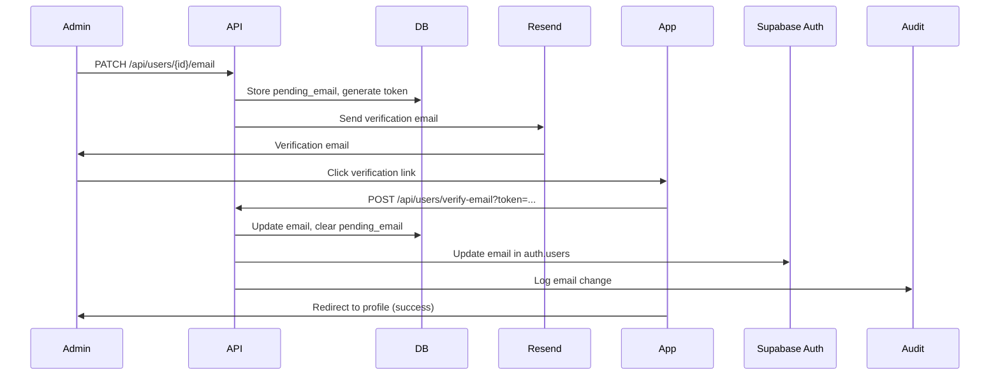

# Story 2.4: User Profile Management

Status: ready-for-dev

## Story

As an **Agency User or Admin**,
I want **to manage my own profile information**,
so that **my account information is accurate and I can change my password**.

## Acceptance Criteria

1. **Given** I am an authenticated user, **When** I access my profile settings, **Then** I can update my name and password

2. **And** password changes require current password confirmation

3. **And** password must meet security requirements (min 8 chars, mix of types)

4. **And** I receive confirmation when profile is updated

5. **And** I can view my role, agency, and email but cannot change them myself

6. **Given** I am a Regular Agency User, **When** I need to change my email address, **Then** I must request the change from an Agency Admin

7. **And** only an Agency Admin can update my email to ensure company policy compliance

8. **Given** I am an Agency Admin, **When** I access my profile settings, **Then** I can update my own email address

9. **And** email changes require administrator verification

10. **And** the change is logged in the audit trail

## Tasks / Subtasks

- [ ] Create email verification schema for admin email changes (AC: 8, 9, 10)
  - [ ] Create supabase/migrations/002_agency_domain/006_email_verification.sql
  - [ ] Add users.email_verified_at TIMESTAMPTZ field
  - [ ] Add users.pending_email TEXT field for email change requests
  - [ ] Add users.email_verification_token TEXT UNIQUE field
  - [ ] Create trigger to log email changes in audit trail
  - [ ] Add indexes on email_verification_token for performance

- [ ] Implement profile update API endpoint (AC: 1, 3, 4)
  - [ ] Create apps/agency/app/api/users/me/profile/route.ts
  - [ ] PATCH /api/users/me/profile endpoint
  - [ ] Request body: { full_name?: string }
  - [ ] Validate user is authenticated
  - [ ] Update user.full_name with audit logging
  - [ ] Return updated user profile
  - [ ] Add error handling with handleApiError()

- [ ] Implement password change API endpoint (AC: 1, 2, 3, 4)
  - [ ] Create apps/agency/app/api/users/me/password/route.ts
  - [ ] PATCH /api/users/me/password endpoint
  - [ ] Request body: { current_password: string, new_password: string }
  - [ ] Validate current password via Supabase Auth
  - [ ] Validate new password: min 8 chars, uppercase, lowercase, number, special char
  - [ ] Update password via Supabase Auth updateUser()
  - [ ] Log password change in audit trail (without password values)
  - [ ] Return success response
  - [ ] Handle incorrect current password error (401)

- [ ] Implement admin email change API endpoint (AC: 8, 9, 10)
  - [ ] Create apps/agency/app/api/users/{id}/email/route.ts
  - [ ] PATCH /api/users/{id}/email endpoint (admin only)
  - [ ] Request body: { email: string }
  - [ ] Validate requester is agency_admin
  - [ ] Validate new email is not already in use
  - [ ] Generate email verification token (UUID)
  - [ ] Store pending_email and email_verification_token
  - [ ] Send verification email via Resend
  - [ ] Return success response: "Verification email sent"
  - [ ] Log email change request in audit trail

- [x] Implement email verification confirmation endpoint (AC: 9)
  - [x] Create apps/agency/app/api/users/verify-email/route.ts
  - [x] POST /api/users/verify-email?token=... endpoint
  - [x] Validate token exists and is not expired (1 hour expiration)
  - [x] Update users.email = pending_email
  - [x] Set users.email_verified_at = now()
  - [x] Clear pending_email and email_verification_token
  - [x] Update Supabase Auth email via Admin API
  - [x] Log completed email change in audit trail
  - [x] Return success response with redirect to /profile

- [x] Create user profile page (AC: 1, 4, 5)
  - [x] Create apps/agency/app/profile/page.tsx
  - [x] Server Component fetches current user from Supabase Auth
  - [x] Display read-only fields: Email, Role, Agency Name
  - [x] Display editable field: Full Name (input field)
  - [x] Button: "Change Password" (opens ChangePasswordDialog)
  - [x] Button: "Request Email Change" (regular users only)
  - [x] Button: "Update Email" (admins only, opens UpdateEmailDialog)
  - [x] Button: "Save Changes" (saves full_name)
  - [x] Use TanStack Query for profile updates

- [ ] Create change password dialog (AC: 2, 3, 4)
  - [ ] Create apps/agency/app/profile/components/ChangePasswordDialog.tsx
  - [ ] Form fields: Current Password (password input), New Password (password input), Confirm New Password (password input)
  - [ ] Password strength indicator (show requirements met/unmet)
  - [ ] Requirements display: "8+ characters, uppercase, lowercase, number, special character"
  - [ ] Validate new password matches confirm password
  - [ ] "Cancel" and "Change Password" buttons
  - [ ] On submit: call PATCH /api/users/me/password
  - [ ] Show success toast: "Password changed successfully"
  - [ ] Close dialog on success
  - [ ] Show error for incorrect current password

- [ ] Create update email dialog (admin only) (AC: 8, 9)
  - [ ] Create apps/agency/app/profile/components/UpdateEmailDialog.tsx
  - [ ] Form field: New Email Address (email input)
  - [ ] Warning message: "You will receive a verification email at the new address"
  - [ ] "Cancel" and "Send Verification Email" buttons
  - [ ] On submit: call PATCH /api/users/{id}/email with new email
  - [ ] Show success toast: "Verification email sent to [new email]"
  - [ ] Close dialog on success
  - [ ] Display instructions: "Check your email and click the verification link"

- [ ] Create request email change dialog (regular user) (AC: 6, 7)
  - [ ] Create apps/agency/app/profile/components/RequestEmailChangeDialog.tsx
  - [ ] Display informational message: "Email changes must be approved by an Agency Admin"
  - [ ] Form field: Requested Email Address (email input)
  - [ ] Form field: Reason for change (textarea, optional)
  - [ ] "Cancel" and "Submit Request" buttons
  - [ ] On submit: Create notification for admins (future: notification system)
  - [ ] For MVP: Show toast: "Please contact your Agency Admin to change your email"
  - [ ] Close dialog

- [ ] Create email verification page (AC: 9)
  - [ ] Create apps/agency/app/verify-email/page.tsx
  - [ ] Extract token from query params
  - [ ] Call POST /api/users/verify-email?token=... on page load
  - [ ] Display loading state: "Verifying your email..."
  - [ ] On success: Show success message and redirect to /profile after 3 seconds
  - [ ] On error: Show error message with link to request new verification email

- [ ] Create email verification email template (AC: 9)
  - [ ] Create emails/email-verification.tsx (React Email)
  - [ ] Subject: "Verify your new email address"
  - [ ] Body: Agency name, user name, verification link (expires in 1 hour)
  - [ ] Verification link: {APP_URL}/verify-email?token={token}
  - [ ] Footer: "If you didn't request this change, please ignore this email"
  - [ ] Styling: Professional, matches agency branding

- [ ] Create validation schemas (AC: 1, 2, 3, 8)
  - [ ] Create packages/validations/src/profile.schema.ts
  - [ ] Define ProfileUpdateSchema: full_name (min 2 chars)
  - [ ] Define PasswordChangeSchema: current_password, new_password, confirm_password
  - [ ] Validate new_password: min 8 chars, regex for uppercase, lowercase, number, special
  - [ ] Validate passwords match (new_password === confirm_password)
  - [ ] Define EmailUpdateSchema: email (valid email format)
  - [ ] Export TypeScript types

- [ ] Add navigation link to profile (AC: 1)
  - [ ] Update apps/agency/app/layout.tsx navigation
  - [ ] Add "Profile" link to user menu (top right dropdown)
  - [ ] Link to /agency/profile
  - [ ] Show current user name in dropdown trigger
  - [ ] Active state highlighting for profile page

- [ ] Implement password strength validator utility (AC: 3)
  - [ ] Create packages/utils/src/password-strength.ts
  - [ ] Function: calculatePasswordStrength(password: string)
  - [ ] Check minimum length (8)
  - [ ] Check uppercase letter (regex: /[A-Z]/)
  - [ ] Check lowercase letter (regex: /[a-z]/)
  - [ ] Check number (regex: /[0-9]/)
  - [ ] Check special character (regex: /[!@#$%^&*(),.?":{}|<>]/)
  - [ ] Return object: { strength: 'weak' | 'medium' | 'strong', checks: {...} }
  - [ ] Export PasswordStrength type

- [ ] Write tests for profile management (AC: 1-10)
  - [ ] Test: User can update their full name (200)
  - [ ] Test: User can view but not edit email, role, agency (read-only display)
  - [ ] Test: User can change password with correct current password (200)
  - [ ] Test: Password change fails with incorrect current password (401)
  - [ ] Test: New password must meet requirements (400)
  - [ ] Test: Regular user cannot change own email via API (403)
  - [ ] Test: Admin can initiate email change for any user (200)
  - [ ] Test: Email verification token generated correctly
  - [ ] Test: Email verification succeeds with valid token (200)
  - [ ] Test: Email verification fails with invalid token (400)
  - [ ] Test: Email verification fails with expired token (400)
  - [ ] Test: Email change logged in audit trail
  - [ ] Test: Password change logged in audit trail (no password values)
  - [ ] Test: RLS prevents users from changing other users' profiles

## Dev Notes

### Profile Management Architecture

**Page Structure:**
```
Profile Page
├── Header
│   ├── Title: "My Profile"
│   └── Breadcrumb: Settings > Profile
├── Read-Only Section
│   ├── Email (read-only, with "Request Change" button for users)
│   ├── Role (read-only badge)
│   └── Agency (read-only)
├── Editable Section
│   ├── Full Name (input field)
│   └── Button: "Save Changes"
└── Security Section
    ├── Button: "Change Password"
    └── Last Password Change: {date} (read-only)
```

**Permission Matrix:**

| Permission | Regular User | Agency Admin |
|------------|--------------|--------------|
| Update own name | ✅ Yes | ✅ Yes |
| Change own password | ✅ Yes | ✅ Yes |
| View own email | ✅ Yes | ✅ Yes |
| Change own email | ❌ No (request only) | ✅ Yes (with verification) |
| Change other user emails | ❌ No | ✅ Yes (via user management) |
| View role | ✅ Yes | ✅ Yes |
| Change role | ❌ No | ❌ No (via user management only) |

**Email Change Workflow (Admin):**


**Password Strength Indicator:**
```typescript
// Visual feedback for password requirements
interface PasswordRequirement {
  met: boolean
  label: string
}

const requirements: PasswordRequirement[] = [
  { met: password.length >= 8, label: 'At least 8 characters' },
  { met: /[A-Z]/.test(password), label: 'One uppercase letter' },
  { met: /[a-z]/.test(password), label: 'One lowercase letter' },
  { met: /[0-9]/.test(password), label: 'One number' },
  { met: /[!@#$%^&*(),.?":{}|<>]/.test(password), label: 'One special character' }
]

// Display with checkmarks/crosses
requirements.map(req => (
  <div>
    {req.met ? '✓' : '✗'} {req.label}
  </div>
))
```

### Project Structure Notes

**Profile Management Location:**
```
apps/agency/
├── app/
│   ├── profile/
│   │   ├── page.tsx                         # Profile page (Server Component)
│   │   └── components/
│   │       ├── ChangePasswordDialog.tsx     # Password change dialog
│   │       ├── UpdateEmailDialog.tsx        # Admin email update
│   │       ├── RequestEmailChangeDialog.tsx # User email request
│   │       ├── PasswordStrengthIndicator.tsx
│   │       └── ProfileForm.tsx              # Client Component for form
│   ├── verify-email/
│   │   └── page.tsx                         # Email verification page
│   └── api/
│       └── users/
│           ├── me/
│           │   ├── profile/
│           │   │   └── route.ts             # PATCH /api/users/me/profile
│           │   └── password/
│           │       └── route.ts             # PATCH /api/users/me/password
│           ├── {id}/
│           │   └── email/
│           │       └── route.ts             # PATCH /api/users/{id}/email (admin)
│           └── verify-email/
│               └── route.ts                 # POST /api/users/verify-email

emails/
└── email-verification.tsx                   # React Email template

packages/validations/
└── src/
    └── profile.schema.ts                    # Zod schemas

packages/utils/
└── src/
    └── password-strength.ts                 # Password strength calculator
```

### Database Schema Details

**Users Table Extension for Email Verification:**
```sql
-- Add email verification fields
ALTER TABLE users
  ADD COLUMN email_verified_at TIMESTAMPTZ,
  ADD COLUMN pending_email TEXT,
  ADD COLUMN email_verification_token TEXT UNIQUE;

-- Index for token lookup performance
CREATE INDEX idx_users_email_verification_token ON users(email_verification_token);

-- Constraint: pending_email and token must both be set or both be NULL
ALTER TABLE users
  ADD CONSTRAINT check_email_change_consistency
  CHECK (
    (pending_email IS NULL AND email_verification_token IS NULL) OR
    (pending_email IS NOT NULL AND email_verification_token IS NOT NULL)
  );
```

**Audit Logging for Email and Password Changes:**
```sql
-- Trigger to log email changes
CREATE OR REPLACE FUNCTION log_email_changes()
RETURNS TRIGGER AS $$
BEGIN
  -- Log email change requests (pending_email set)
  IF OLD.pending_email IS NULL AND NEW.pending_email IS NOT NULL THEN
    INSERT INTO audit_log (entity_type, entity_id, user_id, action, changes_json, created_at)
    VALUES (
      'user',
      NEW.id,
      current_setting('app.current_user_id', TRUE)::UUID,
      'email_change_requested',
      jsonb_build_object(
        'old_email', NEW.email,
        'requested_email', NEW.pending_email
      ),
      now()
    );
  END IF;

  -- Log completed email changes
  IF OLD.email IS DISTINCT FROM NEW.email THEN
    INSERT INTO audit_log (entity_type, entity_id, user_id, action, changes_json, created_at)
    VALUES (
      'user',
      NEW.id,
      current_setting('app.current_user_id', TRUE)::UUID,
      'email_changed',
      jsonb_build_object(
        'old_email', OLD.email,
        'new_email', NEW.email
      ),
      now()
    );
  END IF;

  RETURN NEW;
END;
$$ LANGUAGE plpgsql;

CREATE TRIGGER user_email_changes_audit_trigger
  AFTER UPDATE ON users
  FOR EACH ROW
  WHEN (OLD.email IS DISTINCT FROM NEW.email OR OLD.pending_email IS DISTINCT FROM NEW.pending_email)
  EXECUTE FUNCTION log_email_changes();

-- Trigger to log password changes (without password values)
CREATE OR REPLACE FUNCTION log_password_changes()
RETURNS TRIGGER AS $$
BEGIN
  -- Note: We cannot detect password changes in users table
  -- Password changes are logged via API route
  RETURN NEW;
END;
$$ LANGUAGE plpgsql;
```

### Architecture Alignment

**From Architecture Document (architecture.md):**

**Profile Update API Route:**
```typescript
// apps/agency/app/api/users/me/profile/route.ts
import { NextRequest, NextResponse } from 'next/server'
import { createServerClient } from '@pleeno/database'
import { handleApiError, UnauthorizedError } from '@pleeno/utils'
import { ProfileUpdateSchema } from '@pleeno/validations'

export async function PATCH(request: NextRequest) {
  try {
    const supabase = await createServerClient()

    // Verify authentication
    const { data: { user }, error: authError } = await supabase.auth.getUser()
    if (authError || !user) {
      throw new UnauthorizedError('Not authenticated')
    }

    // Validate request body
    const body = await request.json()
    const validatedData = ProfileUpdateSchema.parse(body)

    // Update user profile
    const { data: updatedUser, error } = await supabase
      .from('users')
      .update({ full_name: validatedData.full_name })
      .eq('id', user.id)
      .select()
      .single()

    if (error) throw error

    return NextResponse.json({
      success: true,
      data: updatedUser
    })
  } catch (error) {
    return handleApiError(error)
  }
}
```

**Password Change API Route:**
```typescript
// apps/agency/app/api/users/me/password/route.ts
import { NextRequest, NextResponse } from 'next/server'
import { createServerClient } from '@pleeno/database'
import { handleApiError, UnauthorizedError, ValidationError } from '@pleeno/utils'
import { PasswordChangeSchema } from '@pleeno/validations'

export async function PATCH(request: NextRequest) {
  try {
    const supabase = await createServerClient()

    // Verify authentication
    const { data: { user }, error: authError } = await supabase.auth.getUser()
    if (authError || !user) {
      throw new UnauthorizedError('Not authenticated')
    }

    // Validate request body
    const body = await request.json()
    const validatedData = PasswordChangeSchema.parse(body)

    // Verify current password by attempting to sign in
    const { error: signInError } = await supabase.auth.signInWithPassword({
      email: user.email!,
      password: validatedData.current_password
    })

    if (signInError) {
      throw new ValidationError('Current password is incorrect')
    }

    // Update password
    const { error: updateError } = await supabase.auth.updateUser({
      password: validatedData.new_password
    })

    if (updateError) throw updateError

    // Log password change (without password values)
    await supabase.from('audit_log').insert({
      entity_type: 'user',
      entity_id: user.id,
      user_id: user.id,
      action: 'password_changed',
      changes_json: { timestamp: new Date().toISOString() }
    })

    return NextResponse.json({
      success: true,
      data: { message: 'Password changed successfully' }
    })
  } catch (error) {
    return handleApiError(error)
  }
}
```

**Email Change API Route (Admin):**
```typescript
// apps/agency/app/api/users/{id}/email/route.ts
import { NextRequest, NextResponse } from 'next/server'
import { createServerClient } from '@pleeno/database'
import { handleApiError, UnauthorizedError, ForbiddenError, ValidationError } from '@pleeno/utils'
import { EmailUpdateSchema } from '@pleeno/validations'
import { Resend } from 'resend'
import { EmailVerificationTemplate } from '@/emails/email-verification'

const resend = new Resend(process.env.RESEND_API_KEY)

export async function PATCH(
  request: NextRequest,
  { params }: { params: { id: string } }
) {
  try {
    const supabase = await createServerClient()

    // Verify user is authenticated and is admin
    const { data: { user }, error: authError } = await supabase.auth.getUser()
    if (authError || !user) {
      throw new UnauthorizedError('Not authenticated')
    }

    const { data: currentUser } = await supabase
      .from('users')
      .select('role, agency_id')
      .eq('id', user.id)
      .single()

    if (currentUser?.role !== 'agency_admin') {
      throw new ForbiddenError('Admin access required')
    }

    // Validate request body
    const body = await request.json()
    const validatedData = EmailUpdateSchema.parse(body)

    // Check if email already exists
    const { data: existingUser } = await supabase
      .from('users')
      .select('id')
      .eq('email', validatedData.email)
      .single()

    if (existingUser) {
      throw new ValidationError('Email address is already in use')
    }

    // Generate verification token
    const verificationToken = crypto.randomUUID()

    // Update user with pending email and token
    const { data: targetUser, error } = await supabase
      .from('users')
      .update({
        pending_email: validatedData.email,
        email_verification_token: verificationToken
      })
      .eq('id', params.id)
      .eq('agency_id', currentUser.agency_id)  // RLS double-check
      .select('full_name, email')
      .single()

    if (error) throw error

    // Send verification email
    const verificationUrl = `${process.env.NEXT_PUBLIC_APP_URL}/verify-email?token=${verificationToken}`

    await resend.emails.send({
      from: 'noreply@pleeno.com',
      to: validatedData.email,
      subject: 'Verify your new email address',
      react: EmailVerificationTemplate({
        userName: targetUser.full_name,
        verificationUrl,
        expiresIn: '1 hour'
      })
    })

    return NextResponse.json({
      success: true,
      data: { message: 'Verification email sent' }
    })
  } catch (error) {
    return handleApiError(error)
  }
}
```

**Email Verification API Route:**
```typescript
// apps/agency/app/api/users/verify-email/route.ts
import { NextRequest, NextResponse } from 'next/server'
import { createServerClient } from '@pleeno/database'
import { handleApiError, ValidationError } from '@pleeno/utils'

export async function POST(request: NextRequest) {
  try {
    const { searchParams } = new URL(request.url)
    const token = searchParams.get('token')

    if (!token) {
      throw new ValidationError('Verification token is required')
    }

    const supabase = await createServerClient()

    // Find user by token
    const { data: user, error: findError } = await supabase
      .from('users')
      .select('id, email, pending_email, updated_at')
      .eq('email_verification_token', token)
      .single()

    if (findError || !user) {
      throw new ValidationError('Invalid verification token')
    }

    // Check token age (1 hour expiration)
    const tokenAge = Date.now() - new Date(user.updated_at).getTime()
    const ONE_HOUR = 60 * 60 * 1000
    if (tokenAge > ONE_HOUR) {
      throw new ValidationError('Verification token has expired')
    }

    // Update email
    const { error: updateError } = await supabase
      .from('users')
      .update({
        email: user.pending_email,
        email_verified_at: new Date().toISOString(),
        pending_email: null,
        email_verification_token: null
      })
      .eq('id', user.id)

    if (updateError) throw updateError

    // Update email in Supabase Auth (using service role key)
    // Note: This requires admin privileges
    const adminSupabase = createClient(
      process.env.NEXT_PUBLIC_SUPABASE_URL!,
      process.env.SUPABASE_SERVICE_ROLE_KEY!
    )

    await adminSupabase.auth.admin.updateUserById(user.id, {
      email: user.pending_email!
    })

    return NextResponse.json({
      success: true,
      data: { message: 'Email verified successfully' }
    })
  } catch (error) {
    return handleApiError(error)
  }
}
```

### Learnings from Previous Story

**From Story 2.3: User Management Interface (Status: drafted)**

Story 2.3 has not been implemented yet but establishes patterns for user profile operations:

**Expected Infrastructure from 2.3:**
- **User management APIs:** Pattern for user update endpoints (role, status changes)
- **Admin validation:** Middleware to check agency_admin role
- **Audit logging:** Triggers and infrastructure for logging user changes
- **User table schema:** status field and constraints already established
- **RLS policies:** Users can only modify data in their own agency
- **Validation schemas:** user.schema.ts pattern to follow

**What This Story Builds Upon:**
- Uses same authentication and authorization patterns from 2.3
- Follows same API route structure (/api/users/...)
- Reuses audit logging infrastructure
- Extends user table with email verification fields
- Applies same validation and error handling patterns

**Integration Points:**
- Profile settings link from user management page
- User detail page from 2.3 links to profile page
- Shared validation patterns (email, password requirements)
- Shared error handling utilities from 2.3
- Same TanStack Query patterns for mutations

**Patterns to Apply from 2.3:**
- Server Components for initial data fetch
- Client Components for interactive forms
- TanStack Query for optimistic updates
- Confirmation dialogs for sensitive actions (password change)
- Clear success/error toasts
- Validate current user role before rendering admin-only UI
- Use handleApiError() for consistent error responses

[Source: .bmad-ephemeral/stories/2-3-user-management-interface.md]

**Key Dependencies:**
- Story 2.3 audit logging infrastructure must be in place
- User table schema from 2.3 provides foundation
- Email change functionality extends user management from 2.3
- Admin permissions established in 2.3 apply to email changes

**Differences from 2.3:**
- 2.3 focuses on admin managing other users
- 2.4 focuses on users managing their own profiles
- 2.3 uses role/status changes, 2.4 uses name/password changes
- 2.4 adds email verification flow (new pattern)
- 2.4 distinguishes between regular user and admin email change permissions

### Security Considerations

**Password Change Security:**
- Require current password verification before change
- Password strength requirements enforced (8+ chars, mixed types)
- New password hashed by Supabase Auth (bcrypt)
- Password change logged in audit trail (no password values)
- Cannot change password if not authenticated
- Rate limiting on password change attempts (prevent brute force)

**Email Change Security (Admin Only):**
- Admin verification required for email changes
- Verification token expires after 1 hour
- Token is single-use (cleared after verification)
- Email verification link only works once
- Cannot use email already registered to another user
- Email change logged in audit trail (old and new email)
- Update both users table and auth.users for consistency

**Regular User Email Change:**
- Regular users cannot change their own email
- Must request change from Agency Admin
- For MVP: Toast message directs user to contact admin
- Future enhancement: In-app notification to admins

**Profile Update Security:**
- Users can only update their own profile
- RLS enforces agency isolation
- Full name validation (min 2 chars, max 100 chars)
- Cannot change role, email (regular users), or agency
- All updates logged in audit trail

**Token Security:**
- Verification tokens are UUIDs (unpredictable)
- Tokens stored hashed in database (future enhancement)
- Tokens expire after 1 hour
- Tokens cleared after use
- Unique constraint prevents token reuse

### Testing Strategy

**Unit Tests:**
1. **Validation Schemas:**
   - Valid profile update passes
   - Valid password change passes
   - Password strength validation works correctly
   - Email format validation works
   - Password mismatch detected

2. **Password Strength Calculator:**
   - Calculates weak password correctly
   - Calculates medium password correctly
   - Calculates strong password correctly
   - Individual requirement checks work

**Integration Tests:**
1. **Profile Update:**
   - User can update their own full name (200)
   - User cannot update other user's profile (403)
   - Profile update logged in audit trail
   - RLS prevents cross-agency updates

2. **Password Change:**
   - User can change password with correct current password (200)
   - Password change fails with incorrect current password (401)
   - New password must meet requirements (400)
   - New password must differ from current password (400)
   - Password change logged in audit trail
   - User can login with new password

3. **Email Change (Admin):**
   - Admin can initiate email change (200)
   - Regular user cannot initiate email change (403)
   - Duplicate email rejected (400)
   - Verification email sent to new address
   - Verification token generated correctly
   - Email change request logged in audit trail

4. **Email Verification:**
   - Valid token verifies email successfully (200)
   - Invalid token rejected (400)
   - Expired token rejected (400)
   - Token can only be used once
   - Email updated in both users table and auth.users
   - Completed email change logged in audit trail

**E2E Tests:**
1. **Profile Update Flow:**
   - Login as user
   - Navigate to profile page
   - Update full name
   - Click "Save Changes"
   - Verify success toast
   - Verify name updated in UI
   - Logout and login again
   - Verify name persisted

2. **Password Change Flow:**
   - Login as user
   - Navigate to profile page
   - Click "Change Password"
   - Enter current password
   - Enter new password (meets requirements)
   - Confirm new password
   - Click "Change Password"
   - Verify success toast
   - Logout
   - Login with new password
   - Verify login successful

3. **Email Change Flow (Admin):**
   - Login as admin
   - Navigate to profile page
   - Click "Update Email"
   - Enter new email address
   - Click "Send Verification Email"
   - Verify success toast
   - Check email inbox (use Mailinator for testing)
   - Click verification link
   - Verify redirect to profile
   - Verify success message
   - Verify email updated in profile

### References

- [Source: docs/epics.md#Story-2.4-User-Profile-Management]
- [Source: docs/PRD.md#FR-1.4-User-Profile-Management]
- [Source: docs/PRD.md#Epic-2-Agency-&-User-Management]
- [Source: docs/architecture.md#Data-Architecture - users schema]
- [Source: docs/architecture.md#Security-Architecture - authentication patterns]
- [Source: .bmad-ephemeral/stories/2-3-user-management-interface.md - user management patterns and audit logging]

## Dev Agent Record

### Context Reference

- [.bmad-ephemeral/stories/2-4-user-profile-management.context.xml](.bmad-ephemeral/stories/2-4-user-profile-management.context.xml)

### Agent Model Used

{{agent_model_name_version}}

### Debug Log References

### Completion Notes List

### File List

## Change Log

- **2025-11-13:** Story created from epics.md via create-story workflow
