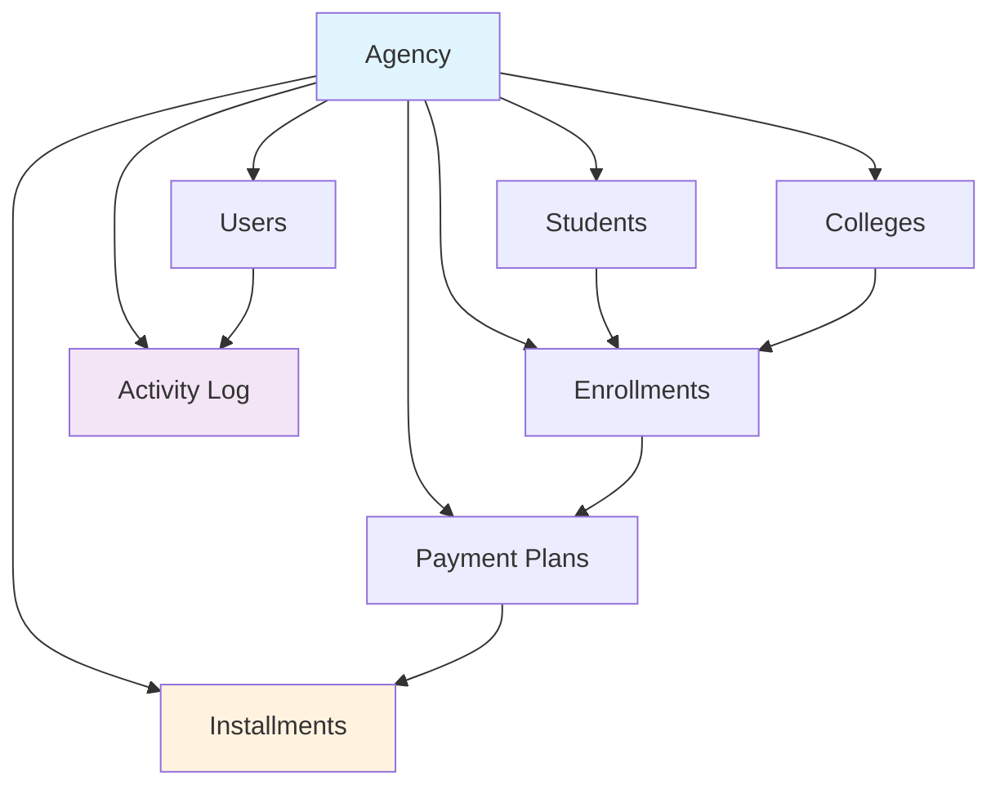

# Database Seeding Requirements for Dashboard API Testing

## Overview

This document outlines comprehensive database seeding requirements to test all dashboard API endpoints. The seed data should create realistic scenarios that exercise the full functionality of each API route.

## Core Requirements

### 1. Agency & Users (Foundation)

**Required Data:**
- ✅ 1 Agency (`Demo Agency`)
- ✅ 2 Users:
  - Admin user: `admin@test.local` / `Password123` (role: `agency_admin`)
  - Regular user: `user@test.local` / `Password123` (role: `agency_user`)

**Status:** Already implemented in `create-demo-user.sh`

---

## Dashboard API Endpoints Data Requirements

### 2. Overdue Payments API (`/api/overdue-payments`)

**Purpose:** Display overdue installments with student and college context

**Required Tables:**
- `colleges` - Educational institutions
- `students` - Student records
- `enrollments` - Student-college enrollments
- `payment_plans` - Payment arrangements
- `installments` - Individual payment items

**Seed Data Requirements:**

#### Colleges (5-10 institutions)
```sql
- 3-4 Australian colleges (different states)
- 2-3 International colleges (UK, USA, Canada)
- Include: name, country, contact details
```

#### Students (20-30 students)
```sql
- Mix of countries of origin (India, China, Nepal, Vietnam, Philippines, etc.)
- Realistic names and contact information
- Various enrollment statuses
```

#### Enrollments (20-30 enrollments)
```sql
- Link students to colleges
- Various start dates (past, current, future)
- Different course types and durations
```

#### Payment Plans (20-30 plans)
```sql
- Total amounts: Range from $5,000 to $50,000
- Commission rates: 10%, 15%, 20%, 25%
- Various start dates
- Mix of statuses: active, completed, cancelled
```

#### Installments - Overdue Scenarios
```sql
Required overdue installments (15-20):
1. Recently overdue (1-7 days):
   - 5 installments
   - Due dates: 1-7 days ago
   - Amounts: $500 - $2,000
   - Status: 'overdue'

2. Moderately overdue (8-30 days):
   - 5 installments
   - Due dates: 8-30 days ago
   - Amounts: $1,000 - $5,000
   - Status: 'overdue'

3. Severely overdue (30+ days):
   - 5 installments
   - Due dates: 30-90 days ago
   - Amounts: $2,000 - $10,000
   - Status: 'overdue'

Also include:
- 20-30 'pending' installments (not yet due)
- 30-40 'paid' installments (historical data)
```

**Expected API Response:**
- Total overdue count: 15-20
- Total overdue amount: $50,000 - $150,000
- Sorted by due date (oldest first)

---

### 3. Seasonal Commission API (`/api/seasonal-commission`)

**Purpose:** 12-month commission trends with peak/quiet indicators

**Required Data:**

#### Installments - Monthly Commission Data
```sql
For each of the last 12 months:
1. Create paid installments with commission
2. Vary amounts to create peaks and valleys
3. Ensure realistic monthly patterns

Month-by-month breakdown:
- Month 1 (12 months ago): $8,000 commission (quiet)
- Month 2: $12,000 commission
- Month 3: $18,000 commission (peak)
- Month 4: $15,000 commission
- Month 5: $10,000 commission
- Month 6: $7,000 commission (quiet)
- Month 7: $14,000 commission
- Month 8: $20,000 commission (peak)
- Month 9: $16,000 commission
- Month 10: $11,000 commission
- Month 11: $9,000 commission (quiet)
- Month 12 (current): $17,000 commission (peak)

Implementation:
- Set installment.paid_date to specific months
- Set installment.status = 'paid'
- Set installment.generates_commission = true
- Calculate commission based on payment_plan.commission_rate_percent
```

**Expected API Response:**
- 12 data points (one per month)
- Top 3 months marked as `is_peak: true`
- Bottom 3 months marked as `is_quiet: true`
- Year-over-year comparison (if previous year data exists)

---

### 4. Commission by School API (`/api/commission-by-school`)

**Purpose:** Top 5 schools by commission with trends

**Required Data:**

#### Current Month Commission by College
```sql
Create paid installments for current month:

College A (Top performer):
- 8 paid installments
- Total commission: $12,000
- Trend: up (previous month: $10,000)

College B:
- 6 paid installments
- Total commission: $9,000
- Trend: up (previous month: $7,500)

College C:
- 5 paid installments
- Total commission: $7,500
- Trend: stable (previous month: $7,400)

College D:
- 4 paid installments
- Total commission: $5,000
- Trend: down (previous month: $6,500)

College E:
- 3 paid installments
- Total commission: $3,500
- Trend: down (previous month: $4,000)

College F-J (lower performers):
- 1-2 paid installments each
- Total commission: $500 - $2,000 each
```

**Expected API Response:**
- Top 5 colleges only
- Percentage share calculated
- Trend indicators (up/down/stable)

---

### 5. Commission by Country API (`/api/commission-by-country`)

**Purpose:** Top 5 countries by commission with trends

**Required Data:**

#### Students with Country of Origin
```sql
Distribute students across countries:
- India: 10 students → $15,000 commission (current month)
- China: 8 students → $12,000 commission
- Nepal: 6 students → $8,000 commission
- Vietnam: 5 students → $6,000 commission
- Philippines: 4 students → $4,000 commission
- Other countries: 2-3 students each → $1,000-$2,000 each
```

**Implementation:**
- Set `students.country_of_origin` field
- Create enrollments and payment plans for these students
- Create paid installments for current month
- Include previous month data for trend calculation

**Expected API Response:**
- Top 5 countries only
- Percentage share calculated
- Trend indicators (up/down/stable)

---

### 6. Payment Status Summary API (`/api/payment-status-summary`)

**Purpose:** Overview of payment statuses across all installments

**Required Data:**

#### Installment Status Distribution
```sql
Create installments with various statuses:

1. Paid (60-70 installments):
   - Status: 'paid'
   - paid_date: various dates in the past
   - paid_amount: equals amount
   - Total value: $200,000 - $300,000

2. Pending (40-50 installments):
   - Status: 'pending'
   - student_due_date: future dates (1-90 days from now)
   - Total value: $100,000 - $150,000

3. Overdue (15-20 installments):
   - Status: 'overdue'
   - student_due_date: past dates
   - Total value: $50,000 - $100,000

4. Cancelled (5-10 installments):
   - Status: 'cancelled'
   - Total value: $10,000 - $20,000
```

**Expected API Response:**
- Count and total amount for each status
- Percentage breakdown
- Summary statistics

---

### 7. Due Soon Count API (`/api/due-soon-count`)

**Purpose:** Count of installments due within next 7 days

**Required Data:**

#### Installments Due Soon
```sql
Create pending installments with due dates:

1. Due today: 2-3 installments
2. Due tomorrow: 2-3 installments
3. Due in 2 days: 2-3 installments
4. Due in 3-7 days: 5-8 installments

Total: 12-17 installments due within 7 days
Total amount: $30,000 - $50,000
```

**Expected API Response:**
- Count of installments due in next 7 days
- Total amount due
- Breakdown by day (optional)

---

### 8. Activity Log API (`/api/activity-log`)

**Purpose:** Recent activity feed with user information

**Required Data:**

#### Activity Log Entries (30-50 entries)
```sql
Create diverse activity types:

1. Student created (5-8 entries):
   - action: 'created'
   - entity_type: 'student'
   - user_id: admin or regular user
   - created_at: various timestamps (last 7 days)

2. Payment received (10-15 entries):
   - action: 'payment_received'
   - entity_type: 'installment'
   - user_id: admin or regular user
   - metadata: { student_name, amount }

3. Enrollment created (5-8 entries):
   - action: 'created'
   - entity_type: 'enrollment'
   - user_id: admin or regular user

4. System actions (5-10 entries):
   - action: 'marked_overdue'
   - entity_type: 'installment'
   - user_id: NULL (system action)
   - metadata: { student_name, amount }

5. Payment plan created (3-5 entries):
   - action: 'created'
   - entity_type: 'payment_plan'
   - user_id: admin or regular user

6. College created (2-3 entries):
   - action: 'created'
   - entity_type: 'college'
   - user_id: admin user
```

**Expected API Response:**
- 20 most recent activities (default limit)
- Chronological order (newest first)
- User information included (or null for system actions)

---

### 9. Cash Flow Projection API (`/api/cash-flow-projection`)

**Purpose:** Time series data for projected cash flow

**Required Data:**

#### Installments - Future Payment Schedule
```sql
Create pending installments for next 90 days:

Week 1 (days 1-7):
- 8-10 pending installments
- Expected: $20,000 - $30,000
- 2-3 paid installments (early payments)
- Paid: $5,000 - $8,000

Week 2 (days 8-14):
- 6-8 pending installments
- Expected: $15,000 - $25,000
- 1-2 paid installments
- Paid: $3,000 - $5,000

Week 3 (days 15-21):
- 10-12 pending installments
- Expected: $25,000 - $35,000
- 0-1 paid installments
- Paid: $0 - $2,000

Week 4 (days 22-28):
- 5-7 pending installments
- Expected: $12,000 - $20,000

Continue pattern for weeks 5-13 (up to 90 days)
```

**Expected API Response:**
- Time series data grouped by week (default)
- Each bucket shows: expected amount, paid amount, installment count
- Installment details for tooltips

---

## Implementation Strategy

### Phase 1: Core Entities (Foundation)
1. ✅ Agencies and Users (already done)
2. Create Colleges (5-10)
3. Create Students (20-30)
4. Create Enrollments (20-30)

### Phase 2: Financial Data
1. Create Payment Plans (20-30)
2. Create Installments with varied statuses:
   - Historical paid installments (for commission trends)
   - Current pending installments
   - Overdue installments
   - Future installments (for cash flow)

### Phase 3: Activity & Metadata
1. Create Activity Log entries
2. Ensure proper timestamps for all records
3. Add realistic metadata and notes

### Phase 4: Data Distribution
1. Ensure realistic distribution across:
   - Countries (for commission by country)
   - Colleges (for commission by school)
   - Time periods (for seasonal trends)
   - Status types (for payment status)

---

## Data Relationships



---

## Validation Checklist

After seeding, verify:

- [ ] `/api/overdue-payments` returns 15-20 overdue items
- [ ] `/api/seasonal-commission` returns 12 months of data with peaks/valleys
- [ ] `/api/commission-by-school` returns top 5 schools with trends
- [ ] `/api/commission-by-country` returns top 5 countries with trends
- [ ] `/api/payment-status-summary` shows distribution across all statuses
- [ ] `/api/due-soon-count` returns 12-17 items due within 7 days
- [ ] `/api/activity-log` returns 20+ recent activities
- [ ] `/api/cash-flow-projection` returns weekly projections for 90 days
- [ ] All API calls return 200 OK (when authenticated)
- [ ] No 404 or 500 errors
- [ ] Data is properly scoped to the demo agency

---

## SQL Seed Script Structure

```sql
BEGIN;

-- 1. Clear existing data (optional)
DELETE FROM installments WHERE agency_id = '...';
DELETE FROM payment_plans WHERE agency_id = '...';
-- ... etc

-- 2. Create Colleges
INSERT INTO colleges (id, agency_id, name, country, ...) VALUES
  ('college-1', 'agency-id', 'Sydney Business College', 'Australia', ...),
  -- ... more colleges

-- 3. Create Students
INSERT INTO students (id, agency_id, name, country_of_origin, ...) VALUES
  ('student-1', 'agency-id', 'Raj Kumar', 'India', ...),
  -- ... more students

-- 4. Create Enrollments
INSERT INTO enrollments (id, agency_id, student_id, college_id, ...) VALUES
  ('enrollment-1', 'agency-id', 'student-1', 'college-1', ...),
  -- ... more enrollments

-- 5. Create Payment Plans
INSERT INTO payment_plans (id, agency_id, enrollment_id, total_amount, commission_rate_percent, ...) VALUES
  ('plan-1', 'agency-id', 'enrollment-1', 25000.00, 15.00, ...),
  -- ... more plans

-- 6. Create Installments (CRITICAL - most complex)
INSERT INTO installments (id, agency_id, payment_plan_id, installment_number, amount, status, student_due_date, paid_date, paid_amount, generates_commission, ...) VALUES
  -- Overdue installments
  ('inst-1', 'agency-id', 'plan-1', 1, 2500.00, 'overdue', CURRENT_DATE - INTERVAL '15 days', NULL, NULL, true, ...),
  
  -- Paid installments (for commission trends)
  ('inst-2', 'agency-id', 'plan-1', 0, 5000.00, 'paid', CURRENT_DATE - INTERVAL '60 days', CURRENT_DATE - INTERVAL '58 days', 5000.00, false, ...),
  
  -- Pending installments (future)
  ('inst-3', 'agency-id', 'plan-1', 2, 2500.00, 'pending', CURRENT_DATE + INTERVAL '30 days', NULL, NULL, true, ...),
  
  -- ... many more installments

-- 7. Create Activity Log
INSERT INTO activity_log (id, agency_id, entity_type, entity_id, action, description, user_id, metadata, created_at) VALUES
  ('activity-1', 'agency-id', 'student', 'student-1', 'created', 'Created new student Raj Kumar', 'admin-user-id', '{"student_name": "Raj Kumar"}', NOW() - INTERVAL '2 days'),
  -- ... more activities

COMMIT;
```

---

## Testing Recommendations

1. **Incremental Testing**: Seed data in phases and test each API endpoint after each phase
2. **Data Validation**: Use SQL queries to verify counts and amounts before testing APIs
3. **Edge Cases**: Include edge cases like:
   - Installments with $0 commission
   - Very old overdue payments (90+ days)
   - Future payments far in advance (6+ months)
   - Cancelled payment plans
4. **Performance**: Ensure enough data to test performance (100+ installments minimum)
5. **Realistic Scenarios**: Use realistic names, amounts, and dates

---

## Next Steps

1. Create a comprehensive SQL seed script based on these requirements
2. Implement as a new npm script: `npm run db:seed-dashboard`
3. Document the script in `SEED_README.md`
4. Create validation queries to verify seed data
5. Test all dashboard API endpoints with seeded data
