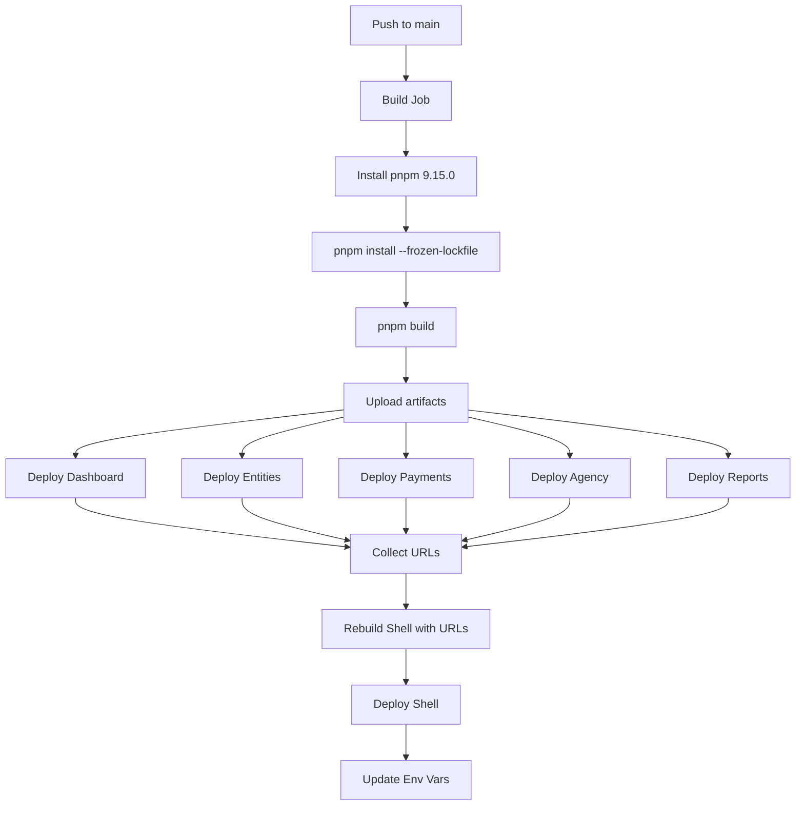

# GitHub Actions + Vercel Deployment Guide
## Multi-Zone pnpm Monorepo with Prebuilt Artifacts

This guide covers deploying the Pleeno multi-zone Next.js monorepo to Vercel using GitHub Actions with prebuilt artifacts, bypassing Vercel's pnpm installation issues.

## Table of Contents

- [Overview](#overview)
- [Architecture](#architecture)
- [Prerequisites](#prerequisites)
- [Initial Setup](#initial-setup)
- [GitHub Secrets Configuration](#github-secrets-configuration)
- [Vercel Project Configuration](#vercel-project-configuration)
- [Deployment Process](#deployment-process)
- [Monitoring & Verification](#monitoring--verification)
- [Troubleshooting](#troubleshooting)
- [Rollback Strategy](#rollback-strategy)

## Overview

This deployment setup solves the Vercel pnpm lockfile compatibility issues (ERR_INVALID_THIS errors) by:

1. **Building locally in GitHub Actions** using pnpm 9.15.0
2. **Deploying prebuilt artifacts** to Vercel with `--prebuilt` flag
3. **Managing multi-zone dependencies** (child apps deployed before shell)
4. **Dynamically injecting child app URLs** into shell configuration

### Key Benefits

✅ Bypasses Vercel's pnpm registry connectivity issues
✅ Faster deployments (build once, deploy to multiple projects)
✅ Consistent build environment (no drift between local/CI/prod)
✅ Full control over build process and dependencies
✅ Automatic multi-zone URL management

### Problem Solved

**Before:** Manual `vercel deploy` commands failing with:
```
WARN  Ignoring not compatible lockfile at /vercel/path0/pnpm-lock.yaml
WARN  GET https://registry.npmjs.org/@axe-core%2Fplaywright error (ERR_INVALID_THIS)
Error: Command "pnpm install" exited with 1
```

**After:** GitHub Actions builds everything locally, uploads prebuilt artifacts, bypasses pnpm installation entirely.

## Architecture

### Project Structure

```
Pleeno/
├── .github/
│   └── workflows/
│       ├── deploy-production.yml    # Production deployments (main branch)
│       └── deploy-preview.yml       # Preview deployments (PRs)
├── apps/
│   ├── shell/          # Main app (plenno.com.au)
│   ├── dashboard/      # Child app (/dashboard route)
│   ├── entities/       # Child app (/entities route)
│   ├── payments/       # Child app (/payments route)
│   ├── agency/         # Child app (/agency route)
│   └── reports/        # Child app (/reports route)
├── packages/           # Shared packages (auth, database, ui, etc.)
├── scripts/
│   ├── deploy-all.sh           # Manual deployment script
│   └── verify-multizone.sh     # Deployment verification
└── vercel.json files   # Per-app Vercel configuration
```

### Deployment Flow



**Step-by-Step:**

1. **Build Job** (runs once)
   - Checkout code
   - Setup Node.js 20 + pnpm 9.15.0
   - Install dependencies with `pnpm install --frozen-lockfile`
   - Build all 6 apps with `pnpm build`
   - Upload build artifacts for each app

2. **Deploy Child Apps** (runs in parallel)
   - Download respective build artifacts
   - Deploy to Vercel with `vercel deploy --prebuilt --prod`
   - Capture deployment URLs
   - Apps: dashboard, entities, payments, agency, reports

3. **Rebuild & Deploy Shell** (runs after child apps)
   - Download dependencies again
   - Rebuild shell with child app URLs as environment variables
   - Deploy shell with `vercel deploy --prebuilt --prod`
   - Update Vercel environment variables for future builds

### Multi-Zone Routing

The shell app proxies requests to child apps using Next.js rewrites:

| Route | Destination | Environment Variable |
|-------|-------------|---------------------|
| `/dashboard` | Dashboard app | `NEXT_PUBLIC_DASHBOARD_URL` |
| `/entities` | Entities app | `NEXT_PUBLIC_ENTITIES_URL` |
| `/payments` | Payments app | `NEXT_PUBLIC_PAYMENTS_URL` |
| `/agency` | Agency app | `NEXT_PUBLIC_AGENCY_URL` |
| `/reports` | Reports app | `NEXT_PUBLIC_REPORTS_URL` |

Configuration in `apps/shell/next.config.ts`:

```typescript
const ZONE_URLS = {
  reports: process.env.NEXT_PUBLIC_REPORTS_URL || 'https://fallback.app',
  entities: process.env.NEXT_PUBLIC_ENTITIES_URL || 'https://fallback.app',
  dashboard: process.env.NEXT_PUBLIC_DASHBOARD_URL || 'https://fallback.app',
  payments: process.env.NEXT_PUBLIC_PAYMENTS_URL || 'https://fallback.app',
  agency: process.env.NEXT_PUBLIC_AGENCY_URL || 'https://fallback.app',
};

async rewrites() {
  return [
    {
      source: '/dashboard/:path*',
      destination: `${ZONE_URLS.dashboard}/dashboard/:path*`,
    },
    // ... more rewrites
  ];
}
```

## Prerequisites

### Required Accounts & Access

- ✅ GitHub repository with Actions enabled
- ✅ Vercel account (team: `antons-projects-1b1c34d6`)
- ✅ Admin access to Vercel projects
- ✅ Repository admin access (to manage secrets)

### Existing Vercel Projects

Verify these projects exist in Vercel:

1. **pleeno-shell-uat** (production domain: `plenno.com.au`)
2. **pleeno-dashboard-uat** (production domain: `dashboard.plenno.com.au`)
3. **pleeno-entities-uat**
4. **pleeno-payments-uat**
5. **pleeno-agency-uat**
6. **pleeno-reports-uat**

All under Vercel team: `antons-projects-1b1c34d6`

### Local Development Tools

```bash
# Node.js 18-20
node --version
# Expected: v18.18.0+ or v20.0.0+

# pnpm 9.15.0 (exact version required)
pnpm --version
# Expected: 9.15.0

# Vercel CLI (latest)
npm install -g vercel@latest
vercel --version
```

## Initial Setup

### Step 1: Get Vercel Credentials

#### 1.1 Organization ID

```bash
# Login to Vercel CLI
vercel login

# List teams and copy org ID
vercel teams list
```

Look for `antons-projects-1b1c34d6` and copy its ID (format: `team_xxxxx`).

#### 1.2 Project IDs

Get project IDs for all 6 projects:

**Method 1: Via Vercel CLI**

```bash
# Navigate to each app and link
cd apps/shell
vercel link
# Follow prompts to link to pleeno-shell-uat
# Project ID will be shown

# Repeat for other apps
cd ../dashboard && vercel link
cd ../entities && vercel link
cd ../payments && vercel link
cd ../agency && vercel link
cd ../reports && vercel link
```

**Method 2: Via Vercel Dashboard**

For each project:
1. Go to https://vercel.com/antons-projects-1b1c34d6/[project-name]/settings
2. Navigate to **General** tab
3. Find **Project ID** (format: `prj_xxxxx`)
4. Copy the ID

#### 1.3 Vercel API Token

Create a token with deployment permissions:

1. Go to https://vercel.com/account/tokens
2. Click **"Create Token"**
3. Configure:
   - **Name:** `GitHub Actions - Pleeno Deployment`
   - **Scope:** Select team `antons-projects-1b1c34d6`
   - **Expiration:** 90 days (or custom)
4. Click **"Create"**
5. **Copy the token immediately** (shown only once!)

⚠️ **Security Note:** Store this token securely. It grants deployment access to all projects in the team.

### Step 2: Configure GitHub Secrets

Navigate to your GitHub repository secrets page:

```
https://github.com/[your-org]/Pleeno/settings/secrets/actions
```

Click **"New repository secret"** and add the following 8 secrets:

| Secret Name | Description | Where to Get | Example Format |
|------------|-------------|--------------|----------------|
| `VERCEL_TOKEN` | Vercel API token | Step 1.3 above | `abc123xyz...` |
| `VERCEL_ORG_ID` | Organization/team ID | Step 1.1 above | `team_abc123...` |
| `VERCEL_PROJECT_ID_SHELL` | Shell project ID | Step 1.2 above | `prj_abc123...` |
| `VERCEL_PROJECT_ID_DASHBOARD` | Dashboard project ID | Step 1.2 above | `prj_def456...` |
| `VERCEL_PROJECT_ID_ENTITIES` | Entities project ID | Step 1.2 above | `prj_ghi789...` |
| `VERCEL_PROJECT_ID_PAYMENTS` | Payments project ID | Step 1.2 above | `prj_jkl012...` |
| `VERCEL_PROJECT_ID_AGENCY` | Agency project ID | Step 1.2 above | `prj_mno345...` |
| `VERCEL_PROJECT_ID_REPORTS` | Reports project ID | Step 1.2 above | `prj_pqr678...` |

**Adding Secrets:**

1. Click **"New repository secret"**
2. Enter **Name** (e.g., `VERCEL_TOKEN`)
3. Paste **Value**
4. Click **"Add secret"**
5. Repeat for all 8 secrets

**Verification:**

After adding, you should see:

```
Repository secrets (8)
├── VERCEL_TOKEN                    Updated X minutes ago
├── VERCEL_ORG_ID                   Updated X minutes ago
├── VERCEL_PROJECT_ID_AGENCY        Updated X minutes ago
├── VERCEL_PROJECT_ID_DASHBOARD     Updated X minutes ago
├── VERCEL_PROJECT_ID_ENTITIES      Updated X minutes ago
├── VERCEL_PROJECT_ID_PAYMENTS      Updated X minutes ago
├── VERCEL_PROJECT_ID_REPORTS       Updated X minutes ago
└── VERCEL_PROJECT_ID_SHELL         Updated X minutes ago
```

## Vercel Project Configuration

For **each of the 6 Vercel projects**, configure these settings:

### Shell App (`pleeno-shell-uat`)

**Settings → General:**

| Setting | Value |
|---------|-------|
| Framework Preset | Next.js |
| Root Directory | `apps/shell` |
| Build Command | `echo 'Build happens in GitHub Actions'` |
| Install Command | `echo 'Dependencies installed in GitHub Actions'` |
| Output Directory | `.next` |
| Node.js Version | 20.x |

**Settings → Git:**

- ✅ **Enable:** "Automatically deploy on push"
- **Branch:** `main`
- **Ignore Build Step:** `echo 'Deployment via GitHub Actions only'`

This prevents Vercel from building on Git push (GitHub Actions handles it).

**Settings → Environment Variables:**

Add these for **Production** environment:

```bash
# Supabase (required)
NEXT_PUBLIC_SUPABASE_URL=https://xxxxx.supabase.co
NEXT_PUBLIC_SUPABASE_ANON_KEY=eyJxxx...

# Cookie domain for auth (required)
NEXT_PUBLIC_COOKIE_DOMAIN=.plenno.com.au

# Shell URL (required)
NEXT_PUBLIC_SHELL_URL=https://plenno.com.au

# Child app URLs (updated automatically by workflow)
NEXT_PUBLIC_DASHBOARD_URL=https://pleeno-dashboard-uat.vercel.app
NEXT_PUBLIC_ENTITIES_URL=https://pleeno-entities-uat.vercel.app
NEXT_PUBLIC_PAYMENTS_URL=https://pleeno-payments-uat.vercel.app
NEXT_PUBLIC_AGENCY_URL=https://pleeno-agency-uat.vercel.app
NEXT_PUBLIC_REPORTS_URL=https://pleeno-reports-uat.vercel.app
```

⚠️ **Note:** Child app URLs will be automatically updated by GitHub Actions after each deployment.

**Settings → Domains:**

- **Production Domain:** `plenno.com.au`
- Configure DNS accordingly

### Child Apps (Dashboard, Entities, Payments, Agency, Reports)

For **each child app**, configure:

**Settings → General:**

| Setting | Value |
|---------|-------|
| Framework Preset | Next.js |
| Root Directory | `apps/[app-name]` |
| Build Command | `echo 'Build happens in GitHub Actions'` |
| Install Command | `echo 'Dependencies installed in GitHub Actions'` |
| Output Directory | `.next` |
| Node.js Version | 20.x |

**Settings → Git:**

- ✅ **Enable:** "Automatically deploy on push"
- **Branch:** `main`
- **Ignore Build Step:** `echo 'Deployment via GitHub Actions only'`

**Settings → Environment Variables:**

Add for **Production** environment:

```bash
# Supabase (required)
NEXT_PUBLIC_SUPABASE_URL=https://xxxxx.supabase.co
NEXT_PUBLIC_SUPABASE_ANON_KEY=eyJxxx...

# Cookie domain (required for shared auth)
NEXT_PUBLIC_COOKIE_DOMAIN=.plenno.com.au

# Shell URL (required)
NEXT_PUBLIC_SHELL_URL=https://plenno.com.au
```

**Settings → Domains:**

Only dashboard has custom domain:
- **Dashboard:** `dashboard.plenno.com.au`
- **Others:** Use Vercel-provided URLs (e.g., `pleeno-entities-uat.vercel.app`)

### Important: Disable Automatic Builds

Since we're deploying via GitHub Actions, we need to prevent Vercel from trying to build on Git push.

For **each project**:

1. Go to **Settings → Git**
2. Find **Ignored Build Step** section
3. Set command to: `echo 'Deployment via GitHub Actions only'`

This ensures Vercel skips the build and waits for prebuilt artifacts from GitHub Actions.

## Deployment Process

### Automatic Deployment (Production)

Deployments to production are triggered automatically when pushing to `main`:

```bash
# Make changes
git add .
git commit -m "feat: add new feature"

# Push to main branch
git push origin main
```

This triggers `.github/workflows/deploy-production.yml`.

**What happens:**

1. Build job runs (3-5 min)
2. Child apps deploy in parallel (2-3 min)
3. Shell rebuilds with child URLs (1-2 min)
4. Shell deploys (1-2 min)
5. **Total: ~7-12 minutes**

**Monitoring:**

- GitHub Actions: https://github.com/[org]/Pleeno/actions
- Vercel Dashboard: https://vercel.com/antons-projects-1b1c34d6

### Automatic Deployment (Preview)

Preview deployments are triggered by pull requests:

```bash
# Create feature branch
git checkout -b feature/my-feature

# Make changes
git add .
git commit -m "feat: add my feature"

# Push and create PR
git push origin feature/my-feature
```

Then create a pull request on GitHub.

This triggers `.github/workflows/deploy-preview.yml`.

**What happens:**

1. Same build/deploy process as production
2. Deploys to preview environment (not production)
3. Comment is added to PR with preview URLs
4. Each PR gets unique preview deployments

### Manual Deployment

#### Via GitHub Actions UI (Recommended)

1. Go to https://github.com/[org]/Pleeno/actions
2. Select **"Deploy to Vercel Production"** workflow
3. Click **"Run workflow"**
4. Select branch (usually `main`)
5. Click **"Run workflow"**

#### Via Local Script

```bash
# Set Vercel token
export VERCEL_TOKEN="your-vercel-token"

# Deploy to production
./scripts/deploy-all.sh production

# Deploy to preview
./scripts/deploy-all.sh preview
```

The script will:
- Build all apps locally
- Deploy child apps first
- Rebuild and deploy shell with URLs

### Deployment Timeline

Expected durations for each phase:

| Phase | Duration | Description |
|-------|----------|-------------|
| **Checkout & Setup** | 30s | Clone repo, setup Node/pnpm |
| **Install Dependencies** | 1-2 min | `pnpm install --frozen-lockfile` |
| **Build All Apps** | 2-3 min | `pnpm build` (Turbo with cache) |
| **Upload Artifacts** | 30s | Upload .next directories |
| **Deploy Child Apps** | 2-3 min | 5 parallel deployments |
| **Rebuild Shell** | 1-2 min | Rebuild with URLs |
| **Deploy Shell** | 1-2 min | Deploy to Vercel |
| **Update Env Vars** | 10s | Update Vercel env vars |
| **Total** | **7-12 min** | Complete deployment |

**Optimization Tips:**

- Turbo cache reduces build time on subsequent runs
- pnpm cache speeds up dependency installation
- Parallel child app deployments save time

## Monitoring & Verification

### GitHub Actions Dashboard

Monitor real-time deployment progress:

1. Go to https://github.com/[org]/Pleeno/actions
2. Click on the running workflow
3. View job progress and logs
4. Each job shows real-time output

**Job Status Indicators:**

- 🟡 Yellow: In progress
- ✅ Green: Completed successfully
- ❌ Red: Failed (click for logs)

### Deployment Summary

After deployment completes, GitHub Actions shows a summary:

**In the workflow summary:**

```markdown
# Deployment Summary

## Child Apps
- Dashboard: https://pleeno-dashboard-uat-abc123.vercel.app
- Entities: https://pleeno-entities-uat-def456.vercel.app
- Payments: https://pleeno-payments-uat-ghi789.vercel.app
- Agency: https://pleeno-agency-uat-jkl012.vercel.app
- Reports: https://pleeno-reports-uat-mno345.vercel.app

## Shell App
- Shell: https://pleeno-shell-uat-pqr678.vercel.app

## Production Domain
- https://plenno.com.au
```

### Automated Verification

Run the verification script after deployment:

```bash
# Verify production
./scripts/verify-multizone.sh https://plenno.com.au

# Verify preview
./scripts/verify-multizone.sh https://pleeno-shell-uat-xyz.vercel.app
```

**What it tests:**

- ✅ Shell homepage loads (200 OK)
- ✅ Multi-zone routes work (`/dashboard`, `/entities`, etc.)
- ✅ API routes accessible (`/api/colleges`, `/api/students`, etc.)

**Output:**

```
🔍 Verifying deployment at: https://plenno.com.au

Testing Shell App
Testing Shell homepage... ✓ (200)

Testing Multi-Zone Routes
Testing Dashboard route... ✓ (200)
Testing Entities route... ✓ (200)
Testing Payments route... ✓ (200)
Testing Agency route... ✓ (200)
Testing Reports route... ✓ (200)

Testing API Routes
Testing Colleges API (via entities)... ✓ (200)
Testing Students API (via entities)... ✓ (200)
Testing Payment Plans API (via payments)... ✓ (200)

=========================================
✓ All tests passed!
=========================================
```

### Manual Verification

#### 1. Test Child Apps Directly

```bash
curl -I https://pleeno-dashboard-uat.vercel.app
curl -I https://pleeno-entities-uat.vercel.app
curl -I https://pleeno-payments-uat.vercel.app
curl -I https://pleeno-agency-uat.vercel.app
curl -I https://pleeno-reports-uat.vercel.app
```

All should return `200 OK`.

#### 2. Test Multi-Zone Routing

```bash
curl -I https://plenno.com.au/dashboard
curl -I https://plenno.com.au/entities
curl -I https://plenno.com.au/payments
curl -I https://plenno.com.au/agency
curl -I https://plenno.com.au/reports
```

All should return `200 OK` and serve content from respective child apps.

#### 3. Browser Testing Checklist

Open browser and verify:

- [ ] https://plenno.com.au loads successfully
- [ ] Navigate to `/dashboard` → Content loads from dashboard app
- [ ] Navigate to `/entities` → Content loads from entities app
- [ ] Open DevTools → Network tab → No CORS errors
- [ ] Test authentication:
  - [ ] Login on shell
  - [ ] Navigate to `/dashboard` → Should remain logged in
  - [ ] Check cookies: Domain should be `.plenno.com.au`

#### 4. Vercel Dashboard Check

For each project:

1. Go to https://vercel.com/antons-projects-1b1c34d6/[project-name]
2. Check latest deployment has "Production" badge
3. Click deployment → View logs → Check for errors
4. Verify deployment shows "Ready" status

## Troubleshooting

### Common Issues

#### 1. Error: "Invalid Project ID"

**Symptom:**

```
Error: Project not found
Error: The specified project was not found or you don't have access
```

**Solution:**

```bash
# Verify project ID in Vercel
cd apps/shell
vercel project ls

# Check the ID matches what's in GitHub secrets
# Update GitHub secret if needed:
# GitHub → Settings → Secrets → Edit VERCEL_PROJECT_ID_SHELL
```

#### 2. Build Fails with pnpm Error

**Symptom:**

```
Error: Unable to find pnpm version 9.15.0
```

**Solution:**

Check workflow file has correct pnpm version:

```yaml
# .github/workflows/deploy-production.yml
env:
  PNPM_VERSION: '9.15.0'  # Must match package.json

# ...

- name: Setup pnpm
  uses: pnpm/action-setup@v4
  with:
    version: ${{ env.PNPM_VERSION }}
```

#### 3. Child App URLs Not Injected in Shell

**Symptom:**

Shell shows fallback URLs or 404 for multi-zone routes.

**Solution:**

Check dependencies in workflow:

```yaml
rebuild-and-deploy-shell:
  needs:
    - build
    - deploy-dashboard  # ✅ Must be listed
    - deploy-entities   # ✅ Must be listed
    - deploy-payments   # ✅ Must be listed
    - deploy-agency     # ✅ Must be listed
    - deploy-reports    # ✅ Must be listed
```

Verify output is captured:

```yaml
outputs:
  url: ${{ steps.deploy.outputs.url }}  # ✅ Must be defined
```

#### 4. Multi-Zone Routes Return 404

**Symptom:**

Accessing `/dashboard` returns 404.

**Solution:**

1. Check shell environment variables in Vercel:

```bash
vercel env ls --token="$VERCEL_TOKEN"
```

Verify `NEXT_PUBLIC_DASHBOARD_URL` is set correctly.

2. Check shell `next.config.ts`:

```typescript
const ZONE_URLS = {
  dashboard: process.env.NEXT_PUBLIC_DASHBOARD_URL || 'fallback',
};
```

3. Redeploy shell:

```bash
# GitHub → Actions → Deploy to Vercel Production → Run workflow
```

#### 5. Vercel Tries to Build Despite --prebuilt

**Symptom:**

Vercel logs show:

```
Running build command...
> echo 'Build happens in GitHub Actions'
Build happens in GitHub Actions
```

**Solution:**

This is expected! The echo command is a placeholder. Vercel will use the prebuilt artifacts uploaded by GitHub Actions. The actual build doesn't run in Vercel.

Verify in GitHub Actions logs:

```
Deploying with --prebuilt flag
✓ Prebuilt artifacts detected
✓ Skipping build step
```

#### 6. Permission Denied for Vercel Token

**Symptom:**

```
Error: Authentication failed
Error: Invalid token
```

**Solution:**

1. Verify token has correct permissions:
   - Go to https://vercel.com/account/tokens
   - Check token scope includes deployment permissions
   - Ensure token hasn't expired

2. Regenerate token if needed:
   - Create new token (Step 1.3 in Initial Setup)
   - Update GitHub secret `VERCEL_TOKEN`

#### 7. Artifacts Upload/Download Fails

**Symptom:**

```
Error: Unable to download artifact
```

**Solution:**

1. Check artifact retention (default: 1 day)
2. Ensure build job completed successfully
3. Verify artifact names match between upload/download

```yaml
# Upload
- name: Upload dashboard build
  uses: actions/upload-artifact@v4
  with:
    name: dashboard-build-${{ needs.build.outputs.cache-key }}

# Download (must match)
- name: Download dashboard build
  uses: actions/download-artifact@v4
  with:
    name: dashboard-build-${{ needs.build.outputs.cache-key }}
```

### Debug Locally

Before pushing to GitHub, test locally:

```bash
# Test full build
pnpm install --frozen-lockfile
pnpm build

# Test individual app
pnpm turbo build --filter=dashboard

# Check for type errors
pnpm type-check

# Verify Turbo cache
pnpm turbo build --dry-run
```

### View Detailed Logs

**GitHub Actions:**

1. Actions tab → Select workflow run
2. Click failed job
3. Expand failed step
4. Copy error message

**Vercel:**

1. Dashboard → Select project
2. Click on deployment
3. View "Building" tab for build logs
4. View "Functions" tab for runtime logs

## Rollback Strategy

### Quick Rollback (via Vercel Dashboard)

If deployment causes issues:

**For each affected project:**

1. Go to https://vercel.com/antons-projects-1b1c34d6/[project-name]
2. Find the previous working deployment (marked with ✅)
3. Click **"..."** menu → **"Promote to Production"**
4. Confirm promotion

This immediately rolls back to the previous version (takes ~30 seconds).

### Rollback via Vercel CLI

```bash
# List recent deployments
cd apps/shell
vercel ls --token="$VERCEL_TOKEN"

# Promote specific deployment to production
vercel promote https://pleeno-shell-uat-abc123.vercel.app --token="$VERCEL_TOKEN"

# Repeat for each affected app
```

### Rollback via Git

To prevent future deployments of broken code:

**Option 1: Revert commit (safe)**

```bash
# Revert the problematic commit
git revert <commit-hash>
git push origin main

# This creates a new commit that undoes the changes
# Automatic deployment will redeploy previous working state
```

**Option 2: Reset to previous commit (destructive)**

```bash
# Reset to previous commit
git reset --hard <previous-commit-hash>

# Force push (requires admin access)
git push --force origin main

# ⚠️ Warning: This rewrites history
```

### Emergency Rollback Procedure

If production is completely broken:

1. **Immediate (< 1 min):** Promote last working deployment in Vercel dashboard
2. **Communication:** Notify team via Slack/email
3. **Investigation:** Review logs to identify the issue
4. **Fix:** Create hotfix branch with fix
5. **Test:** Create PR and verify preview deployment
6. **Deploy:** Merge PR to trigger automatic deployment

### Testing Rollback

Periodically test rollback procedure:

```bash
# 1. Make a test change
echo "// test rollback" >> apps/shell/app/page.tsx
git commit -am "test: rollback test"
git push origin main

# 2. Wait for deployment to complete

# 3. Practice rollback via Vercel dashboard
# - Find previous deployment
# - Promote to production

# 4. Verify previous version is live
curl -I https://plenno.com.au

# 5. Clean up test
git revert HEAD
git push origin main
```

## Advanced Topics

### Caching Strategies

The workflows implement several caching mechanisms:

**1. pnpm Store Cache**

```yaml
- name: Get pnpm store directory
  id: pnpm-cache
  run: echo "STORE_PATH=$(pnpm store path)" >> $GITHUB_OUTPUT

- name: Setup pnpm cache
  uses: actions/cache@v4
  with:
    path: ${{ steps.pnpm-cache.outputs.STORE_PATH }}
    key: ${{ runner.os }}-pnpm-store-${{ hashFiles('**/pnpm-lock.yaml') }}
```

**2. Turbo Build Cache**

Add Turbo Remote Cache for faster builds:

```yaml
# Add to build job
env:
  TURBO_TOKEN: ${{ secrets.TURBO_TOKEN }}
  TURBO_TEAM: ${{ secrets.TURBO_TEAM }}
```

Setup:
1. Go to Vercel → Settings → Integrations → Turbo
2. Copy token and team ID
3. Add as GitHub secrets

### Custom Deployment Branches

Deploy from branches other than `main`:

```yaml
# .github/workflows/deploy-staging.yml
on:
  push:
    branches:
      - staging
```

### Deployment Notifications

Add Slack notifications:

```yaml
- name: Notify Slack
  if: always()
  uses: slackapi/slack-github-action@v1
  with:
    payload: |
      {
        "text": "Deployment ${{ job.status }}: ${{ github.sha }}",
        "blocks": [
          {
            "type": "section",
            "text": {
              "type": "mrkdwn",
              "text": "Deployment *${{ job.status }}*\nCommit: `${{ github.sha }}`\nBranch: `${{ github.ref }}`"
            }
          }
        ]
      }
  env:
    SLACK_WEBHOOK_URL: ${{ secrets.SLACK_WEBHOOK_URL }}
```

### Environment-Specific Deployments

Create separate workflows for staging:

```bash
# Copy production workflow
cp .github/workflows/deploy-production.yml .github/workflows/deploy-staging.yml

# Edit deploy-staging.yml:
# - Change branch to 'staging'
# - Use different VERCEL_PROJECT_ID secrets (staging projects)
# - Deploy to staging environment
```

## Maintenance

### Regular Tasks

**Weekly:**
- [ ] Review deployment logs for warnings/errors
- [ ] Check Vercel usage/billing
- [ ] Verify all 6 apps are healthy

**Monthly:**
- [ ] Rotate Vercel API token
- [ ] Update dependencies: `pnpm update -r`
- [ ] Review GitHub Actions cache efficiency
- [ ] Test rollback procedure

**Quarterly:**
- [ ] Audit Vercel project settings
- [ ] Review GitHub secrets (remove unused)
- [ ] Update Node.js version in workflows if needed
- [ ] Analyze and optimize bundle sizes

### Updating Dependencies

```bash
# Update all dependencies
pnpm update -r

# Update specific package across monorepo
pnpm update next@latest -r

# Update pnpm itself
# 1. Edit package.json: "packageManager": "pnpm@9.16.0"
# 2. Edit workflows: PNPM_VERSION: '9.16.0'
# 3. Run: pnpm install
# 4. Commit pnpm-lock.yaml
```

### Security Best Practices

**Secrets Management:**
- ✅ Store all secrets in GitHub Secrets (encrypted)
- ✅ Rotate Vercel token every 90 days
- ✅ Use least-privilege principle for tokens
- ✅ Never commit secrets to repository
- ✅ Audit access logs regularly

**Token Permissions:**

Create tokens with minimal required permissions:
- ✅ Deployment: Required
- ✅ Read project settings: Required
- ❌ Modify project settings: Not required
- ❌ Billing: Not required

## Appendix

### Files Created

**Workflows:**
- `.github/workflows/deploy-production.yml` - Production deployments (main branch)
- `.github/workflows/deploy-preview.yml` - Preview deployments (pull requests)

**Scripts:**
- `scripts/deploy-all.sh` - Manual deployment script
- `scripts/verify-multizone.sh` - Deployment verification script

**Configuration:**
- `apps/*/vercel.json` - Per-app Vercel configuration (updated for prebuilt)
- `.vercelignore` - Files to ignore during deployment

**Documentation:**
- `GITHUB_ACTIONS_DEPLOYMENT.md` - This file

### Key Environment Variables

**Shell App:**
```bash
NEXT_PUBLIC_DASHBOARD_URL    # Dashboard app URL (auto-updated)
NEXT_PUBLIC_ENTITIES_URL     # Entities app URL (auto-updated)
NEXT_PUBLIC_PAYMENTS_URL     # Payments app URL (auto-updated)
NEXT_PUBLIC_AGENCY_URL       # Agency app URL (auto-updated)
NEXT_PUBLIC_REPORTS_URL      # Reports app URL (auto-updated)
NEXT_PUBLIC_SHELL_URL        # Shell app URL (manual)
NEXT_PUBLIC_COOKIE_DOMAIN    # Cookie domain for auth (manual)
NEXT_PUBLIC_SUPABASE_URL     # Supabase URL (manual)
NEXT_PUBLIC_SUPABASE_ANON_KEY # Supabase key (manual)
```

**Child Apps:**
```bash
NEXT_PUBLIC_SHELL_URL        # Shell app URL (manual)
NEXT_PUBLIC_COOKIE_DOMAIN    # Cookie domain for auth (manual)
NEXT_PUBLIC_SUPABASE_URL     # Supabase URL (manual)
NEXT_PUBLIC_SUPABASE_ANON_KEY # Supabase key (manual)
```

### Useful Commands

```bash
# Check workflow syntax
actionlint .github/workflows/*.yml

# Test local build
pnpm install --frozen-lockfile && pnpm build

# List Vercel projects
vercel projects ls --token="$VERCEL_TOKEN"

# List deployments for a project
cd apps/shell && vercel ls --token="$VERCEL_TOKEN"

# Get project details
vercel project inspect --token="$VERCEL_TOKEN"

# Check environment variables
vercel env ls --token="$VERCEL_TOKEN"
```

### Resources

- [Vercel CLI Documentation](https://vercel.com/docs/cli)
- [GitHub Actions Documentation](https://docs.github.com/en/actions)
- [Next.js Multi-Zones](https://nextjs.org/docs/advanced-features/multi-zones)
- [pnpm Workspaces](https://pnpm.io/workspaces)
- [Turbo Documentation](https://turbo.build/repo/docs)
- [Vercel Prebuilt Deployments](https://vercel.com/docs/cli#commands/deploy/unique-options/prebuilt)

---

**Document Version:** 1.0.0
**Last Updated:** 2025-12-12
**Maintained By:** Development Team
**Questions?** Review troubleshooting section or check GitHub Actions logs
