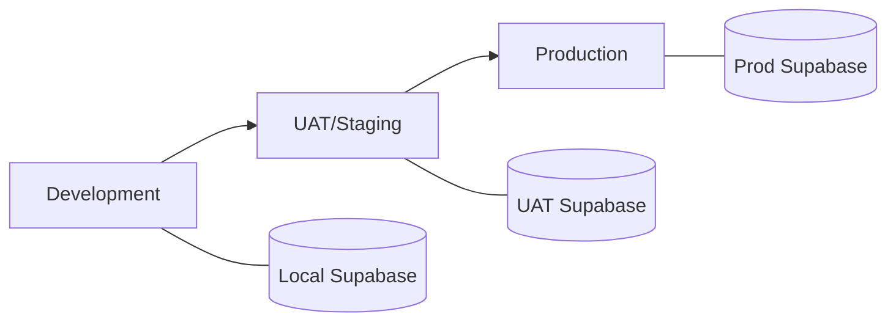
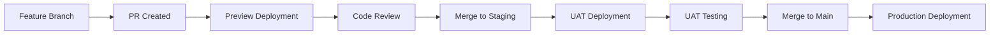
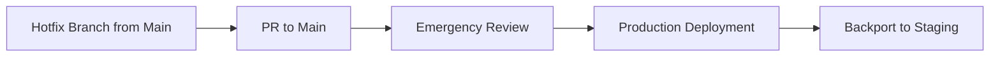

# Pleeno - Vercel Multi-Zone Deployment Plan

## Executive Summary

This document outlines the comprehensive deployment strategy for Pleeno's multi-zone Next.js architecture on Vercel. The plan includes development, UAT/staging, and production environments with proper CI/CD pipelines, environment management, and deployment workflows.

## Table of Contents

1. [Architecture Overview](#architecture-overview)
2. [Environment Strategy](#environment-strategy)
3. [Vercel Project Structure](#vercel-project-structure)
4. [Deployment Configuration](#deployment-configuration)
5. [Environment Variables Management](#environment-variables-management)
6. [CI/CD Pipeline](#cicd-pipeline)
7. [Deployment Workflows](#deployment-workflows)
8. [Monitoring and Rollback](#monitoring-and-rollback)
9. [Cost Estimation](#cost-estimation)
10. [Implementation Timeline](#implementation-timeline)

## Architecture Overview

### Multi-Zone Structure

Pleeno uses a **Next.js Multi-Zone** architecture with 6 independent applications:

```
pleeno-monorepo/
├── apps/
│   ├── shell/      # Main entry point & router
│   ├── dashboard/  # Analytics & KPIs
│   ├── agency/     # User & agency management
│   ├── entities/   # Colleges & students
│   ├── payments/   # Payment plans & installments
│   └── reports/    # Reporting & exports
└── packages/       # Shared code
```

### Key Benefits

- **Independent Deployments**: Each zone can be deployed separately
- **Smaller Bundle Sizes**: Users only load relevant zone code
- **Team Autonomy**: Different teams can own different zones
- **Fault Isolation**: Zone failures don't affect others
- **Optimized Performance**: Parallel builds and focused bundles

## Environment Strategy

### Three-Tier Environment Setup



#### 1. Development Environment
- **Purpose**: Local development and testing
- **Database**: Local Supabase (Docker)
- **URLs**: localhost:3000-3005
- **Branch**: feature branches

#### 2. UAT/Staging Environment
- **Purpose**: User acceptance testing, integration testing
- **Database**: Dedicated UAT Supabase project
- **URLs**: *.uat.pleeno.com
- **Branch**: `staging` or `uat`
- **Access**: Password protected (Vercel authentication)

#### 3. Production Environment
- **Purpose**: Live application
- **Database**: Production Supabase project
- **URLs**: *.pleeno.com
- **Branch**: `main`
- **Access**: Public

## Vercel Project Structure

### Required Vercel Projects

Each environment requires separate Vercel projects:

#### Production Projects (6 projects)
```
pleeno-shell-prod
pleeno-dashboard-prod
pleeno-agency-prod
pleeno-entities-prod
pleeno-payments-prod
pleeno-reports-prod
```

#### UAT Projects (6 projects)
```
pleeno-shell-uat
pleeno-dashboard-uat
pleeno-agency-uat
pleeno-entities-uat
pleeno-payments-uat
pleeno-reports-uat
```

### Project Configuration

Each Vercel project requires:

1. **Root Directory**: `apps/{zone-name}`
2. **Build Command**: `cd ../.. && pnpm turbo run build --filter={zone-name}`
3. **Output Directory**: `apps/{zone-name}/.next`
4. **Install Command**: `pnpm install --frozen-lockfile`
5. **Framework Preset**: Next.js

## Deployment Configuration

### 1. Shell App Configuration (Main Router)

Create `apps/shell/vercel.json`:

```json
{
  "buildCommand": "cd ../.. && pnpm turbo run build --filter=shell",
  "outputDirectory": "apps/shell/.next",
  "installCommand": "pnpm install --frozen-lockfile",
  "framework": "nextjs",
  "regions": ["iad1"],
  "functions": {
    "apps/shell/app/api/auth/[...nextauth]/route.ts": {
      "maxDuration": 30
    }
  }
}
```

### 2. Zone App Configuration (Example: Dashboard)

Create `apps/dashboard/vercel.json`:

```json
{
  "buildCommand": "cd ../.. && pnpm turbo run build --filter=dashboard",
  "outputDirectory": "apps/dashboard/.next",
  "installCommand": "pnpm install --frozen-lockfile",
  "framework": "nextjs",
  "regions": ["iad1"],
  "functions": {
    "apps/dashboard/app/api/*/route.ts": {
      "maxDuration": 30
    }
  }
}
```

### 3. Domain Configuration

#### Production Domains
```
app.pleeno.com              → pleeno-shell-prod
dashboard.pleeno.com        → pleeno-dashboard-prod
agency.pleeno.com          → pleeno-agency-prod
entities.pleeno.com        → pleeno-entities-prod
payments.pleeno.com        → pleeno-payments-prod
reports.pleeno.com         → pleeno-reports-prod
```

#### UAT Domains
```
uat.pleeno.com             → pleeno-shell-uat
dashboard.uat.pleeno.com   → pleeno-dashboard-uat
agency.uat.pleeno.com      → pleeno-agency-uat
entities.uat.pleeno.com    → pleeno-entities-uat
payments.uat.pleeno.com    → pleeno-payments-uat
reports.uat.pleeno.com     → pleeno-reports-uat
```

## Environment Variables Management

### Variable Categories

#### 1. Supabase Configuration
```env
# Production
NEXT_PUBLIC_SUPABASE_URL=https://[prod-project].supabase.co
NEXT_PUBLIC_SUPABASE_ANON_KEY=eyJ...prod...
SUPABASE_SERVICE_ROLE_KEY=eyJ...prod-service...

# UAT
NEXT_PUBLIC_SUPABASE_URL=https://[uat-project].supabase.co
NEXT_PUBLIC_SUPABASE_ANON_KEY=eyJ...uat...
SUPABASE_SERVICE_ROLE_KEY=eyJ...uat-service...
```

#### 2. Zone URLs (Shell App)
```env
# Production
NEXT_PUBLIC_DASHBOARD_URL=https://dashboard.pleeno.com
NEXT_PUBLIC_AGENCY_URL=https://agency.pleeno.com
NEXT_PUBLIC_ENTITIES_URL=https://entities.pleeno.com
NEXT_PUBLIC_PAYMENTS_URL=https://payments.pleeno.com
NEXT_PUBLIC_REPORTS_URL=https://reports.pleeno.com

# UAT
NEXT_PUBLIC_DASHBOARD_URL=https://dashboard.uat.pleeno.com
NEXT_PUBLIC_AGENCY_URL=https://agency.uat.pleeno.com
NEXT_PUBLIC_ENTITIES_URL=https://entities.uat.pleeno.com
NEXT_PUBLIC_PAYMENTS_URL=https://payments.uat.pleeno.com
NEXT_PUBLIC_REPORTS_URL=https://reports.uat.pleeno.com
```

#### 3. External Services
```env
# Same for both environments (with different API keys)
RESEND_API_KEY=re_...
OPENAI_API_KEY=sk-...
SENTRY_DSN=https://...@sentry.io/...
```

### Environment Variable Setup Script

Create `scripts/setup-vercel-env.sh`:

```bash
#!/bin/bash

# Usage: ./setup-vercel-env.sh <project-name> <environment>

PROJECT=$1
ENV=$2

if [ "$ENV" = "production" ]; then
  ENV_FILE=".env.production"
elif [ "$ENV" = "uat" ]; then
  ENV_FILE=".env.uat"
else
  echo "Invalid environment. Use 'production' or 'uat'"
  exit 1
fi

# Read env file and set variables in Vercel
while IFS='=' read -r key value; do
  if [[ ! "$key" =~ ^# && -n "$key" ]]; then
    vercel env add "$key" "$ENV" < <(echo "$value") --yes --project="$PROJECT"
  fi
done < "$ENV_FILE"

echo "Environment variables set for $PROJECT ($ENV)"
```

## CI/CD Pipeline

### GitHub Actions Workflow

Create `.github/workflows/deploy-multi-zone.yml`:

```yaml
name: Deploy Multi-Zone

on:
  push:
    branches:
      - main        # Production
      - staging     # UAT
  pull_request:
    types: [opened, synchronize]

env:
  TURBO_TOKEN: ${{ secrets.TURBO_TOKEN }}
  TURBO_TEAM: ${{ vars.TURBO_TEAM }}

jobs:
  determine-environment:
    runs-on: ubuntu-latest
    outputs:
      environment: ${{ steps.set-env.outputs.environment }}
      deploy: ${{ steps.set-env.outputs.deploy }}
    steps:
      - id: set-env
        run: |
          if [[ "${{ github.ref }}" == "refs/heads/main" ]]; then
            echo "environment=production" >> $GITHUB_OUTPUT
            echo "deploy=true" >> $GITHUB_OUTPUT
          elif [[ "${{ github.ref }}" == "refs/heads/staging" ]]; then
            echo "environment=uat" >> $GITHUB_OUTPUT
            echo "deploy=true" >> $GITHUB_OUTPUT
          else
            echo "environment=preview" >> $GITHUB_OUTPUT
            echo "deploy=false" >> $GITHUB_OUTPUT
          fi

  lint-and-test:
    runs-on: ubuntu-latest
    steps:
      - uses: actions/checkout@v4

      - name: Setup pnpm
        uses: pnpm/action-setup@v4
        with:
          version: 10.20.0

      - name: Setup Node.js
        uses: actions/setup-node@v4
        with:
          node-version: '20'
          cache: 'pnpm'

      - name: Install dependencies
        run: pnpm install --frozen-lockfile

      - name: Run linting
        run: pnpm turbo run lint

      - name: Run type checking
        run: pnpm turbo run type-check

      - name: Run tests
        run: pnpm test

  build:
    needs: [determine-environment, lint-and-test]
    runs-on: ubuntu-latest
    strategy:
      matrix:
        app: [shell, dashboard, agency, entities, payments, reports]
    steps:
      - uses: actions/checkout@v4

      - name: Setup pnpm
        uses: pnpm/action-setup@v4
        with:
          version: 10.20.0

      - name: Setup Node.js
        uses: actions/setup-node@v4
        with:
          node-version: '20'
          cache: 'pnpm'

      - name: Install dependencies
        run: pnpm install --frozen-lockfile

      - name: Build ${{ matrix.app }}
        run: pnpm turbo run build --filter=${{ matrix.app }}
        env:
          NODE_ENV: production

      - name: Upload build artifacts
        uses: actions/upload-artifact@v4
        with:
          name: ${{ matrix.app }}-build
          path: apps/${{ matrix.app }}/.next

  deploy:
    needs: [determine-environment, build]
    if: needs.determine-environment.outputs.deploy == 'true'
    runs-on: ubuntu-latest
    environment: ${{ needs.determine-environment.outputs.environment }}
    strategy:
      matrix:
        app: [shell, dashboard, agency, entities, payments, reports]
    steps:
      - uses: actions/checkout@v4

      - name: Download build artifacts
        uses: actions/download-artifact@v4
        with:
          name: ${{ matrix.app }}-build
          path: apps/${{ matrix.app }}/.next

      - name: Deploy to Vercel
        env:
          VERCEL_TOKEN: ${{ secrets.VERCEL_TOKEN }}
          VERCEL_ORG_ID: ${{ secrets.VERCEL_ORG_ID }}
          VERCEL_PROJECT_ID: ${{ secrets[format('VERCEL_PROJECT_ID_{0}_{1}', matrix.app, needs.determine-environment.outputs.environment)] }}
        run: |
          npm i -g vercel
          cd apps/${{ matrix.app }}

          if [ "${{ needs.determine-environment.outputs.environment }}" = "production" ]; then
            vercel deploy --prod --token=$VERCEL_TOKEN
          else
            vercel deploy --token=$VERCEL_TOKEN
          fi

  integration-tests:
    needs: deploy
    if: needs.determine-environment.outputs.environment == 'uat'
    runs-on: ubuntu-latest
    steps:
      - uses: actions/checkout@v4

      - name: Setup Node.js
        uses: actions/setup-node@v4
        with:
          node-version: '20'

      - name: Run E2E tests against UAT
        run: |
          npm install -g playwright
          playwright install chromium
          UAT_URL=https://uat.pleeno.com playwright test
        env:
          TEST_USER_EMAIL: ${{ secrets.UAT_TEST_USER_EMAIL }}
          TEST_USER_PASSWORD: ${{ secrets.UAT_TEST_USER_PASSWORD }}
```

## Deployment Workflows

### 1. Feature Development Workflow



### 2. Hotfix Workflow



### 3. Deployment Commands

#### Manual Deployment (if needed)
```bash
# Deploy specific app to UAT
./scripts/deploy-zone.sh dashboard uat

# Deploy all apps to production
./scripts/deploy-all.sh production

# Rollback specific app
./scripts/rollback.sh payments production
```

Create `scripts/deploy-zone.sh`:

```bash
#!/bin/bash

APP=$1
ENV=$2

if [ "$ENV" = "production" ]; then
  PROJECT="pleeno-$APP-prod"
  PROD_FLAG="--prod"
elif [ "$ENV" = "uat" ]; then
  PROJECT="pleeno-$APP-uat"
  PROD_FLAG=""
else
  echo "Invalid environment"
  exit 1
fi

echo "Deploying $APP to $ENV..."

cd "apps/$APP"
vercel deploy $PROD_FLAG --token=$VERCEL_TOKEN --scope=$VERCEL_ORG_ID --project=$PROJECT

echo "Deployment complete!"
```

## Monitoring and Rollback

### 1. Monitoring Setup

#### Vercel Analytics
- Enable for all production projects
- Monitor Core Web Vitals
- Set up alerts for performance degradation

#### Sentry Integration
```javascript
// apps/*/sentry.client.config.ts
import * as Sentry from "@sentry/nextjs";

Sentry.init({
  dsn: process.env.NEXT_PUBLIC_SENTRY_DSN,
  environment: process.env.NEXT_PUBLIC_ENVIRONMENT,
  tracesSampleRate: process.env.NODE_ENV === "production" ? 0.1 : 1.0,
  debug: false,
  replaysOnErrorSampleRate: 1.0,
  replaysSessionSampleRate: 0.1,
  integrations: [
    Sentry.replayIntegration({
      maskAllText: true,
      blockAllMedia: true,
    }),
  ],
});
```

#### Custom Health Checks
Create `apps/*/app/api/health/route.ts`:

```typescript
import { NextResponse } from 'next/server';
import { createServerClient } from '@pleeno/database/server';

export async function GET() {
  try {
    // Check database connection
    const supabase = createServerClient();
    const { error } = await supabase.from('agencies').select('count').single();

    if (error) throw error;

    return NextResponse.json({
      status: 'healthy',
      timestamp: new Date().toISOString(),
      zone: process.env.NEXT_PUBLIC_ZONE_NAME,
      environment: process.env.NEXT_PUBLIC_ENVIRONMENT,
    });
  } catch (error) {
    return NextResponse.json({
      status: 'unhealthy',
      error: error.message,
      timestamp: new Date().toISOString(),
    }, { status: 503 });
  }
}
```

### 2. Rollback Procedures

#### Instant Rollback (Vercel)
```bash
# List deployments
vercel list --project=pleeno-shell-prod

# Rollback to specific deployment
vercel rollback [deployment-url] --project=pleeno-shell-prod
```

#### Database Rollback
```bash
# Create backup before deployment
supabase db dump --project-ref [prod-ref] > backup-$(date +%Y%m%d-%H%M%S).sql

# Restore if needed
psql [connection-string] < backup-20240112-143022.sql
```

### 3. Monitoring Dashboard

Create a unified monitoring dashboard:

```typescript
// apps/shell/app/admin/monitoring/page.tsx
export default async function MonitoringPage() {
  const zones = ['dashboard', 'agency', 'entities', 'payments', 'reports'];

  const healthChecks = await Promise.all(
    zones.map(async (zone) => {
      try {
        const res = await fetch(`https://${zone}.pleeno.com/api/health`);
        const data = await res.json();
        return { zone, ...data };
      } catch (error) {
        return { zone, status: 'error', error: error.message };
      }
    })
  );

  return (
    <div>
      <h1>System Health</h1>
      {healthChecks.map((check) => (
        <ZoneHealthCard key={check.zone} {...check} />
      ))}
    </div>
  );
}
```

## Cost Estimation

### Vercel Costs

#### Pro Plan ($20/user/month)
- Required for team collaboration
- Includes analytics and monitoring
- Multiple team members support

#### Usage-Based Pricing
- **Bandwidth**: $40 per 100GB
- **Function Executions**: $40 per 100M invocations
- **Build Minutes**: $10 per 1000 minutes

#### Estimated Monthly Costs
```
Base (Pro Plan):           $20 x 3 users = $60
12 Projects:               Included in Pro
Bandwidth (500GB):         $200
Function Executions:       $80
Build Minutes:             $30
Preview Deployments:       $20
------------------------
Total:                     ~$390/month
```

### Supabase Costs

#### Pro Plan ($25/project/month)
- 3 projects needed (Dev, UAT, Production)
- Production: Pro Plan ($25)
- UAT: Pro Plan ($25)
- Development: Free tier

#### Estimated Monthly Costs
```
Production:                $25
UAT:                       $25
Database Storage:          $10
File Storage:              $5
------------------------
Total:                     ~$65/month
```

### Total Infrastructure Cost
**Estimated: $455/month** for complete multi-environment setup

## Implementation Timeline

### Phase 1: Foundation (Week 1-2)
- [ ] Create Vercel organization
- [ ] Set up 12 Vercel projects (6 prod, 6 UAT)
- [ ] Configure domain DNS
- [ ] Set up Supabase UAT project
- [ ] Create environment variable files

### Phase 2: Configuration (Week 2-3)
- [ ] Configure each Vercel project settings
- [ ] Set environment variables for all projects
- [ ] Update next.config.ts files with production URLs
- [ ] Set up Sentry projects
- [ ] Configure Resend for each environment

### Phase 3: CI/CD Pipeline (Week 3-4)
- [ ] Implement GitHub Actions workflows
- [ ] Set up branch protection rules
- [ ] Configure automated testing
- [ ] Test deployment pipelines
- [ ] Document deployment processes

### Phase 4: Monitoring & Operations (Week 4-5)
- [ ] Enable Vercel Analytics
- [ ] Configure Sentry error tracking
- [ ] Set up health check endpoints
- [ ] Create monitoring dashboard
- [ ] Establish on-call procedures

### Phase 5: Testing & Validation (Week 5-6)
- [ ] Deploy to UAT environment
- [ ] Run integration tests
- [ ] Perform load testing
- [ ] Security audit
- [ ] Final production deployment

## Security Considerations

### 1. Environment Isolation
- Separate Supabase projects for each environment
- Different API keys and secrets
- Network isolation between environments

### 2. Access Control
- UAT environment password protected
- Production access limited to authorized personnel
- Audit logs for all deployments

### 3. Secret Management
- Use Vercel environment variables (encrypted)
- Rotate keys regularly
- Never commit secrets to repository

### 4. Deployment Security
- Require PR reviews before production
- Automated security scanning in CI/CD
- Rollback capabilities for emergencies

## Troubleshooting Guide

### Common Issues and Solutions

#### 1. Zone Not Loading
**Issue**: 404 errors when accessing zone URLs
**Solution**:
- Verify rewrites in shell app's next.config.ts
- Check environment variables for zone URLs
- Ensure all zones are deployed

#### 2. Authentication Issues
**Issue**: Users logged out when switching zones
**Solution**:
- Verify cookie domain settings
- Check Supabase Auth configuration
- Ensure same auth keys across zones

#### 3. Build Failures
**Issue**: Turbo build fails in Vercel
**Solution**:
- Check monorepo detection settings
- Verify build commands include proper paths
- Ensure pnpm version matches locally

#### 4. Environment Variable Issues
**Issue**: Missing or incorrect env vars
**Solution**:
- Use Vercel CLI to verify: `vercel env ls`
- Check for typos in variable names
- Ensure all required vars are set

## Appendix

### A. Required Environment Variables

Full list for each zone:

```env
# Core Supabase
NEXT_PUBLIC_SUPABASE_URL
NEXT_PUBLIC_SUPABASE_ANON_KEY
SUPABASE_SERVICE_ROLE_KEY

# Zone URLs (Shell app only)
NEXT_PUBLIC_DASHBOARD_URL
NEXT_PUBLIC_AGENCY_URL
NEXT_PUBLIC_ENTITIES_URL
NEXT_PUBLIC_PAYMENTS_URL
NEXT_PUBLIC_REPORTS_URL

# External Services
RESEND_API_KEY
OPENAI_API_KEY
NEXT_PUBLIC_SENTRY_DSN
SENTRY_AUTH_TOKEN

# Application
NEXT_PUBLIC_APP_URL
NEXT_PUBLIC_ENVIRONMENT
NEXT_PUBLIC_ZONE_NAME
```

### B. Vercel CLI Commands Reference

```bash
# Login
vercel login

# List projects
vercel project ls

# Create new project
vercel project add pleeno-dashboard-uat

# Set environment variables
vercel env add NEXT_PUBLIC_SUPABASE_URL production

# Deploy
vercel deploy --prod

# Rollback
vercel rollback [url]

# View logs
vercel logs [project-name]
```

### C. Migration Checklist

Before going live:

- [ ] All zones deployed successfully
- [ ] Authentication working across zones
- [ ] Database migrations applied
- [ ] Environment variables verified
- [ ] SSL certificates active
- [ ] Monitoring enabled
- [ ] Backup procedures tested
- [ ] Rollback procedures documented
- [ ] Team trained on deployment process
- [ ] Customer communication prepared

## Support and Maintenance

### Contact Information
- **DevOps Lead**: [Contact]
- **On-Call Schedule**: [Link to schedule]
- **Emergency Procedures**: [Link to runbook]

### Resources
- [Vercel Documentation](https://vercel.com/docs)
- [Next.js Multi-Zones](https://nextjs.org/docs/advanced-features/multi-zones)
- [Supabase Documentation](https://supabase.com/docs)
- [Internal Wiki]: [Link to wiki]

---

*Last Updated: December 2024*
*Version: 1.0.0*