# EPIC 2: Agency & User Management - Process Swimlane Diagram

**Author:** System Generated
**Date:** 2025-11-11
**Project Level:** MVP

---

## Overview

This swimlane diagram illustrates the complete workflow for EPIC 2: Agency & User Management, showing the interactions between Agency Admin, System, Email Service, and Agency Users across all four user stories.

---

## Swimlane Diagram

```mermaid
%%{init: {'theme':'base', 'themeVariables': { 'primaryColor':'#f0f0f0','primaryTextColor':'#000','primaryBorderColor':'#333','lineColor':'#333','secondaryColor':'#e0e0e0','tertiaryColor':'#d0d0d0'}}}%%

flowchart TB
    subgraph AdminLane["👤 Agency Admin"]
        A1[Login for First Time]
        A2[Navigate to Agency Settings]
        A3[Enter Agency Details:<br/>Name, Contact, Currency, Timezone]
        A4[Review & Save Agency Profile]
        A5[Navigate to User Management]
        A6[Click Invite User]
        A7[Enter Email & Select Role<br/>Admin or User]
        A8[Send Invitation]
        A9[View User List]
        A10[Select User Action:<br/>Change Role, Deactivate,<br/>Reactivate, Resend Invite]
        A11[Confirm Action]
        A12[Review Updated User List]
    end

    subgraph SystemLane["⚙️ System"]
        S1[Display Dashboard<br/>with Default Agency Info]
        S2[Show Agency Settings Page<br/>with Current Data]
        S3[Validate Input in Real-time<br/>Currency & Timezone Selection]
        S4[Save Agency Data to DB<br/>Update Application Header]
        S5[Display Success Message<br/>Refresh with Timezone]
        S6[Show User Management Page<br/>Display Current Team]
        S7[Open Invitation Form<br/>Show Role Descriptions]
        S8[Validate Email & Role<br/>Generate Secure Token]
        S9[Add Pending Invitation<br/>Display in List 7-day Expiry]
        S10[Show All Users:<br/>Active & Pending<br/>with Roles & Status]
        S11[Process Action:<br/>Update Role/Status<br/>Resend/Delete Invite]
        S12[Update Database<br/>Log Audit Trail]
        S13[Show Confirmation<br/>Update User Display]
    end

    subgraph EmailLane["📧 Email Service"]
        E1[Send Invitation Email<br/>with Secure Signup Link<br/>7-day Expiration]
        E2[Deliver Email to Recipient]
        E3[Send Reactivation Email<br/>when User Re-enabled]
        E4[Send Verification Email<br/>for Email Change]
    end

    subgraph UserLane["👥 Agency User"]
        U1[Receive Invitation Email]
        U2[Click Signup Link]
        U3[Complete Registration<br/>Set Password]
        U4[Login to System<br/>Auto-associated with Agency]
        U5[Navigate to Profile Settings]
        U6[Update Name, Email,<br/>or Password]
        U7[Verify New Email<br/>if Changed]
        U8[Save Profile Changes]
        U9[View Updated Profile<br/>Note Read-only Fields]
    end

    %% Story 2.1: Agency Profile Setup
    A1 --> S1
    S1 --> A2
    A2 --> S2
    S2 --> A3
    A3 --> S3
    S3 --> A4
    A4 --> S4
    S4 --> S5
    S5 --> A5

    %% Story 2.2: User Invitation System
    A5 --> S6
    S6 --> A6
    A6 --> S7
    S7 --> A7
    A7 --> S8
    S8 --> A8
    A8 --> E1
    E1 --> E2
    S8 --> S9
    E2 --> U1
    U1 --> U2
    U2 --> U3
    U3 --> U4

    %% Story 2.3: User Management Interface
    S9 --> A9
    A9 --> S10
    S10 --> A10
    A10 --> A11
    A11 --> S11
    S11 --> S12
    S12 --> S13
    S13 --> A12
    S11 -.->|If Reactivating| E3

    %% Story 2.4: User Profile Management
    U4 --> U5
    U5 --> U6
    U6 -.->|If Email Changed| E4
    E4 -.-> U7
    U6 --> U8
    U7 --> U8
    U8 --> U9

    %% Styling
    classDef adminStyle fill:#e3f2fd,stroke:#1976d2,stroke-width:2px,color:#000
    classDef systemStyle fill:#fff3e0,stroke:#f57c00,stroke-width:2px,color:#000
    classDef emailStyle fill:#f3e5f5,stroke:#7b1fa2,stroke-width:2px,color:#000
    classDef userStyle fill:#e8f5e9,stroke:#388e3c,stroke-width:2px,color:#000

    class A1,A2,A3,A4,A5,A6,A7,A8,A9,A10,A11,A12 adminStyle
    class S1,S2,S3,S4,S5,S6,S7,S8,S9,S10,S11,S12,S13 systemStyle
    class E1,E2,E3,E4 emailStyle
    class U1,U2,U3,U4,U5,U6,U7,U8,U9 userStyle
```

---

## Workflow Description by Story

### Story 2.1: Agency Profile Setup
**Actor:** Agency Admin
**Flow:** A1 → S1 → A2 → S2 → A3 → S3 → A4 → S4 → S5 → A5

1. Admin logs in and sees default agency information
2. Navigates to agency settings
3. Enters agency details (name, contact, currency, timezone)
4. System validates input in real-time
5. Admin saves the profile
6. System persists data and updates the application header
7. Success confirmation shown

### Story 2.2: User Invitation System
**Actors:** Agency Admin, System, Email Service, Agency User
**Flow:** A5 → S6 → A6 → S7 → A7 → S8 → A8 → E1 → E2 → U1 → U2 → U3 → U4

1. Admin navigates to User Management
2. Clicks "Invite User" button
3. Enters email and selects role (Admin or User)
4. System validates and generates secure token
5. Email service sends invitation with 7-day expiry
6. New user receives email and clicks signup link
7. User completes registration and is auto-associated with agency

### Story 2.3: User Management Interface
**Actors:** Agency Admin, System, Email Service
**Flow:** S9 → A9 → S10 → A10 → A11 → S11 → S12 → S13 → A12

1. System displays pending invitation in user list
2. Admin reviews all users (active and pending)
3. Admin selects action: change role, deactivate, reactivate, or resend invite
4. Confirms the action
5. System processes the change and logs audit trail
6. Optional: reactivation email sent if user is re-enabled
7. Updated user list displayed with confirmation

### Story 2.4: User Profile Management
**Actors:** Agency User, System, Email Service
**Flow:** U4 → U5 → U6 → (E4 → U7) → U8 → U9

1. User navigates to profile settings
2. Updates name, email, or password
3. If email changed: verification email sent and user must verify
4. User saves changes
5. System updates profile and shows confirmation
6. User views updated profile with read-only fields (agency, role) noted

---

## Key Decision Points

| Decision Point | Actor | Options | Impact |
|----------------|-------|---------|--------|
| **Role Selection** | Agency Admin | Admin or User | Determines user permissions |
| **Invitation Response** | Email Service | Email delivered or failed | Affects user onboarding |
| **User Action Type** | Agency Admin | Change role, deactivate, reactivate, resend, delete | Modifies user access and status |
| **Email Change** | Agency User | Keep existing or change | Triggers verification flow |
| **Password Change** | Agency User | Update or skip | Requires current password validation |

---

## Critical Paths

### 🎯 Happy Path: Complete Onboarding
1. Admin sets up agency profile → Success
2. Admin invites team member → Email delivered
3. User accepts invitation → Registration complete
4. User updates profile → Profile active

### ⚠️ Alternative Path: Invitation Issues
1. Admin invites user → Email not received
2. Admin resends invitation → Email delivered
3. User accepts → Registration complete

### 🔄 Management Path: User Lifecycle
1. User active → Admin changes role → Role updated
2. User needs removal → Admin deactivates → Access revoked
3. User returns → Admin reactivates → Access restored

---

## Integration Points

### Database Operations
- **Story 2.1:** `agencies` table (insert/update)
- **Story 2.2:** `users` table (insert), `invitations` table (insert)
- **Story 2.3:** `users` table (update), `audit_logs` table (insert)
- **Story 2.4:** `users` table (update), email verification tokens

### External Services
- **Email Service:** Invitation emails, reactivation emails, verification emails
- **Authentication:** Password hashing, session management, token generation

### UI Touchpoints
- Agency Settings page
- User Management page
- Profile Settings page
- Email templates

---

## Success Metrics

- **Agency Profile Setup:** 95% completion within 2 minutes of first login
- **User Invitations:** 80% acceptance rate within 48 hours
- **User Management:** Avg 30 seconds to find and modify any user
- **Profile Updates:** 95% completed without support tickets

---

## Notes

- All flows assume successful authentication
- Error handling and validation occur at each system step
- Audit logging happens automatically for all user management actions
- Email delivery is asynchronous and may have delays
- Read-only fields (agency, role) can only be changed by admins in User Management

